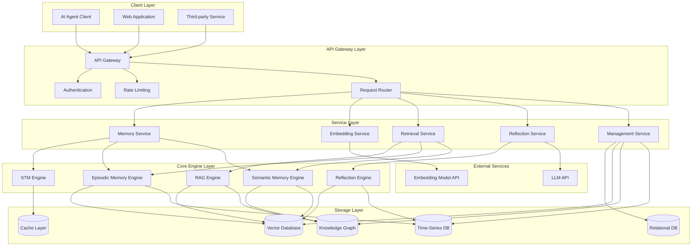
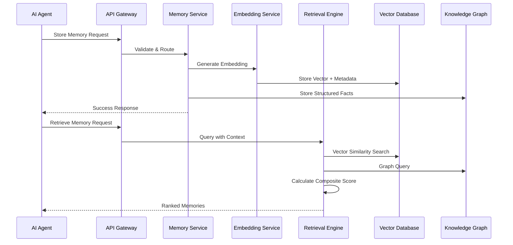
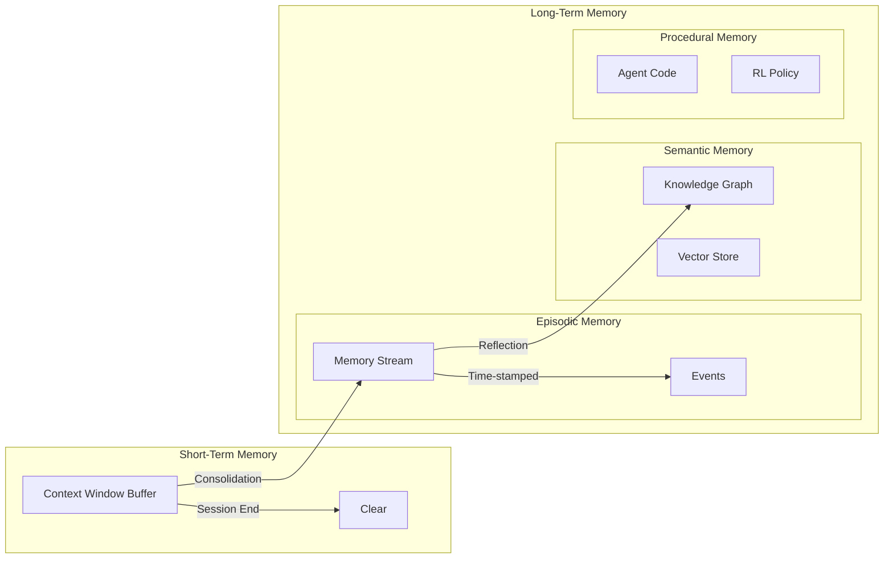

# Agent Memory Platform - Architecture Design

## Overview

Agent Memory Platform 是一个专业的 AI Agent 记忆系统，提供完整的记忆管理能力，包括短期记忆、长期记忆（情景、语义、程序）以及高级记忆管理功能。系统采用微服务架构，支持水平扩展，提供 RESTful API 接口供外部系统集成。

### Core Design Principles

1. **模块化设计**: 各记忆类型独立模块，松耦合高内聚
2. **可扩展性**: 支持水平扩展，满足大规模部署需求
3. **高性能**: 优化检索算法，确保毫秒级响应
4. **安全优先**: 数据隔离、加密、审计全覆盖
5. **标准化接口**: RESTful API + OpenAPI 规范

## Architecture

### System Architecture Diagram



### Data Flow Architecture



### Memory Type Architecture



## Components and Interfaces

### 1. API Gateway

**Responsibility**: 统一入口、认证、限流、路由

**Key Components**:
- Authentication Middleware: JWT token 验证
- Rate Limiter: Token bucket 算法
- Request Router: 基于路径的服务路由
- API Versioning: URL 版本控制

**Interfaces**:
```typescript
interface APIGatewayConfig {
  port: number;
  corsOrigins: string[];
  rateLimitPerMinute: number;
  jwtSecret: string;
}

interface AuthContext {
  userId: string;
  agentId: string;
  permissions: string[];
}
```

### 2. Memory Service

**Responsibility**: 核心记忆管理逻辑，协调各记忆引擎

**Key Components**:
- Memory Writer: 记忆写入协调器
- Memory Reader: 记忆读取协调器
- Session Manager: 会话生命周期管理
- Memory Validator: 记忆数据验证

**Interfaces**:
```typescript
interface MemoryService {
  // 存储记忆
  storeMemory(memory: MemoryInput): Promise<MemoryRecord>;
  
  // 检索记忆
  retrieveMemories(query: RetrievalQuery): Promise<MemoryRecord[]>;
  
  // 更新记忆
  updateMemory(id: string, updates: Partial<MemoryRecord>): Promise<void>;
  
  // 删除记忆
  deleteMemory(id: string): Promise<void>;
  
  // 获取会话记忆
  getSessionMemories(sessionId: string): Promise<MemoryRecord[]>;
}

interface MemoryInput {
  agentId: string;
  sessionId?: string;
  content: string;
  type: 'episodic' | 'semantic' | 'short-term';
  metadata?: Record<string, any>;
}

interface MemoryRecord {
  id: string;
  agentId: string;
  sessionId?: string;
  content: string;
  type: string;
  embedding?: number[];
  importance?: number;
  timestamp: Date;
  metadata: Record<string, any>;
}
```

### 3. Embedding Service

**Responsibility**: 文本向量化，管理嵌入模型

**Key Components**:
- Embedding Model Client: 调用外部嵌入模型
- Batch Processor: 批量嵌入处理
- Cache Manager: 嵌入结果缓存
- Model Selector: 多模型选择策略

**Interfaces**:
```typescript
interface EmbeddingService {
  // 生成单个嵌入
  generateEmbedding(text: string, model?: string): Promise<number[]>;
  
  // 批量生成嵌入
  generateBatchEmbeddings(texts: string[], model?: string): Promise<number[][]>;
  
  // 获取嵌入维度
  getEmbeddingDimension(model: string): number;
}

interface EmbeddingConfig {
  defaultModel: string;
  apiEndpoint: string;
  apiKey: string;
  batchSize: number;
  cacheEnabled: boolean;
}
```

### 4. Retrieval Service

**Responsibility**: 实现多种检索策略，包括 RAG

**Key Components**:
- Vector Retriever: 向量相似性检索
- Graph Retriever: 知识图谱查询
- Hybrid Retriever: 混合检索策略
- RAG Orchestrator: RAG 流程编排

**Interfaces**:
```typescript
interface RetrievalService {
  // 向量检索
  vectorSearch(query: VectorQuery): Promise<SearchResult[]>;
  
  // 图检索
  graphSearch(query: GraphQuery): Promise<GraphResult[]>;
  
  // 混合检索
  hybridSearch(query: HybridQuery): Promise<SearchResult[]>;
  
  // RAG 检索
  ragRetrieve(query: RAGQuery): Promise<RAGResult>;
}

interface VectorQuery {
  embedding: number[];
  topK: number;
  filters?: Record<string, any>;
  similarityThreshold?: number;
}

interface SearchResult {
  id: string;
  content: string;
  score: number;
  metadata: Record<string, any>;
}

interface RAGQuery {
  query: string;
  agentId: string;
  topK: number;
  mode: 'standard' | 'agentic';
}

interface RAGResult {
  augmentedPrompt: string;
  sources: SearchResult[];
  metadata: {
    retrievalTime: number;
    totalResults: number;
  };
}
```

### 5. Reflection Service

**Responsibility**: 实现记忆反思机制

**Key Components**:
- Reflection Trigger: 反思触发器
- Insight Generator: 见解生成器（调用 LLM）
- Reflection Scorer: 反思重要性评分
- Reflection Store: 反思结果存储

**Interfaces**:
```typescript
interface ReflectionService {
  // 触发反思
  triggerReflection(agentId: string, context?: ReflectionContext): Promise<Reflection>;
  
  // 获取反思历史
  getReflections(agentId: string, limit?: number): Promise<Reflection[]>;
  
  // 检查是否需要反思
  shouldReflect(agentId: string): Promise<boolean>;
}

interface ReflectionContext {
  timeRange?: { start: Date; end: Date };
  importanceThreshold?: number;
  maxMemories?: number;
}

interface Reflection {
  id: string;
  agentId: string;
  insights: string[];
  sourceMemories: string[];
  importance: number;
  timestamp: Date;
}
```

### 6. STM Engine (Short-Term Memory)

**Responsibility**: 管理会话级短期记忆

**Key Components**:
- Context Window Manager: 上下文窗口管理
- Session Store: 会话存储（Redis）
- Eviction Policy: 淘汰策略（FIFO）

**Interfaces**:
```typescript
interface STMEngine {
  // 添加到短期记忆
  addToSTM(sessionId: string, content: string): Promise<void>;
  
  // 获取短期记忆
  getSTM(sessionId: string): Promise<string[]>;
  
  // 清空短期记忆
  clearSTM(sessionId: string): Promise<void>;
  
  // 设置窗口大小
  setWindowSize(sessionId: string, size: number): Promise<void>;
}
```

### 7. Episodic Memory Engine

**Responsibility**: 管理情景记忆流

**Key Components**:
- Memory Stream Writer: 记忆流写入器
- Importance Scorer: 重要性评分器
- Temporal Indexer: 时间索引器
- Composite Retriever: 三分量检索器

**Interfaces**:
```typescript
interface EpisodicMemoryEngine {
  // 记录事件
  recordEvent(event: EpisodicEvent): Promise<string>;
  
  // 检索情景记忆
  retrieveEpisodes(query: EpisodicQuery): Promise<EpisodicMemory[]>;
  
  // 计算重要性
  calculateImportance(event: EpisodicEvent): Promise<number>;
}

interface EpisodicEvent {
  agentId: string;
  content: string;
  eventType: 'observation' | 'action' | 'interaction';
  timestamp: Date;
  context?: Record<string, any>;
}

interface EpisodicQuery {
  agentId: string;
  queryText?: string;
  timeRange?: { start: Date; end: Date };
  minImportance?: number;
  topK: number;
  weights?: {
    recency: number;
    importance: number;
    relevance: number;
  };
}

interface EpisodicMemory {
  id: string;
  content: string;
  importance: number;
  timestamp: Date;
  recencyScore: number;
  relevanceScore: number;
  compositeScore: number;
}
```

### 8. Semantic Memory Engine

**Responsibility**: 管理语义记忆和知识图谱

**Key Components**:
- Knowledge Graph Manager: 知识图谱管理器
- Entity Extractor: 实体提取器
- Relation Mapper: 关系映射器
- Graph Query Engine: 图查询引擎

**Interfaces**:
```typescript
interface SemanticMemoryEngine {
  // 存储事实
  storeFact(fact: Fact): Promise<string>;
  
  // 查询知识
  queryKnowledge(query: KnowledgeQuery): Promise<KnowledgeResult[]>;
  
  // 添加实体
  addEntity(entity: Entity): Promise<string>;
  
  // 添加关系
  addRelation(relation: Relation): Promise<string>;
  
  // 图遍历
  traverseGraph(startNode: string, depth: number): Promise<GraphPath[]>;
}

interface Fact {
  subject: string;
  predicate: string;
  object: string;
  confidence?: number;
  source?: string;
}

interface Entity {
  id?: string;
  type: string;
  properties: Record<string, any>;
}

interface Relation {
  from: string;
  to: string;
  type: string;
  properties?: Record<string, any>;
}

interface KnowledgeQuery {
  pattern?: Fact;
  entityId?: string;
  queryText?: string;
  depth?: number;
}
```

### 9. Management Service

**Responsibility**: 记忆生命周期管理

**Key Components**:
- Memory Filter: 智能过滤器
- Forgetting Scheduler: 遗忘调度器
- Consolidation Engine: 整合引擎
- Analytics Collector: 分析数据收集器

**Interfaces**:
```typescript
interface ManagementService {
  // 配置过滤规则
  setFilterRules(agentId: string, rules: FilterRule[]): Promise<void>;
  
  // 配置遗忘策略
  setForgettingPolicy(agentId: string, policy: ForgettingPolicy): Promise<void>;
  
  // 执行记忆整合
  consolidateMemories(agentId: string, options?: ConsolidationOptions): Promise<ConsolidationResult>;
  
  // 获取记忆统计
  getMemoryStats(agentId: string): Promise<MemoryStats>;
  
  // 导出记忆
  exportMemories(agentId: string, format: 'json' | 'csv'): Promise<Buffer>;
  
  // 删除所有记忆
  purgeMemories(agentId: string): Promise<void>;
}

interface FilterRule {
  type: 'importance' | 'content' | 'metadata';
  condition: string;
  action: 'accept' | 'reject';
}

interface ForgettingPolicy {
  enabled: boolean;
  strategy: 'time-based' | 'access-based' | 'importance-based';
  threshold: number;
  archiveBeforeDelete: boolean;
}

interface ConsolidationOptions {
  timeRange?: { start: Date; end: Date };
  summarizationLevel: 'low' | 'medium' | 'high';
}

interface MemoryStats {
  totalMemories: number;
  byType: Record<string, number>;
  storageSize: number;
  oldestMemory: Date;
  newestMemory: Date;
  averageImportance: number;
}
```

## Data Models

### Core Data Models

```typescript
// 基础记忆模型
interface BaseMemory {
  id: string;
  agentId: string;
  content: string;
  embedding?: number[];
  timestamp: Date;
  createdAt: Date;
  updatedAt: Date;
  metadata: Record<string, any>;
}

// 短期记忆
interface ShortTermMemory extends BaseMemory {
  sessionId: string;
  position: number; // 在窗口中的位置
  expiresAt: Date;
}

// 情景记忆
interface EpisodicMemoryRecord extends BaseMemory {
  eventType: 'observation' | 'action' | 'interaction';
  importance: number; // 1-10
  accessCount: number;
  lastAccessedAt: Date;
}

// 语义记忆（向量存储）
interface SemanticMemoryRecord extends BaseMemory {
  source: string;
  category?: string;
  verified: boolean;
}

// 知识图谱节点
interface KGNode {
  id: string;
  type: string;
  properties: Record<string, any>;
  createdAt: Date;
}

// 知识图谱边
interface KGEdge {
  id: string;
  from: string;
  to: string;
  type: string;
  properties: Record<string, any>;
  weight?: number;
}

// 反思记录
interface ReflectionRecord {
  id: string;
  agentId: string;
  insights: string[];
  sourceMemoryIds: string[];
  importance: number;
  embedding?: number[];
  timestamp: Date;
}

// Agent 配置
interface AgentConfig {
  agentId: string;
  userId: string;
  name: string;
  stmWindowSize: number;
  embeddingModel: string;
  reflectionThreshold: number;
  filterRules: FilterRule[];
  forgettingPolicy: ForgettingPolicy;
  createdAt: Date;
}

// 审计日志
interface AuditLog {
  id: string;
  userId: string;
  agentId: string;
  action: string;
  resource: string;
  timestamp: Date;
  ipAddress: string;
  details?: Record<string, any>;
}
```

### Database Schema

#### Vector Database (Qdrant/Weaviate)

```
Collection: episodic_memories
- id: string
- vector: float[]
- payload:
  - agent_id: string
  - content: string
  - importance: number
  - timestamp: datetime
  - event_type: string
  - metadata: object

Collection: semantic_memories
- id: string
- vector: float[]
- payload:
  - agent_id: string
  - content: string
  - source: string
  - category: string
  - metadata: object

Collection: reflections
- id: string
- vector: float[]
- payload:
  - agent_id: string
  - insights: string[]
  - source_memory_ids: string[]
  - importance: number
  - timestamp: datetime
```

#### Knowledge Graph (Neo4j)

```cypher
// 节点类型
(:Entity {id, type, properties, created_at})
(:Concept {id, name, description, created_at})
(:Agent {id, name, created_at})

// 关系类型
-[:RELATES_TO {type, weight, created_at}]->
-[:IS_A {confidence}]->
-[:HAS_PROPERTY {key, value}]->
-[:OBSERVED_BY {agent_id, timestamp}]->
```

#### Time-Series Database (InfluxDB)

```
Measurement: memory_events
- tags:
  - agent_id
  - event_type
  - importance_level
- fields:
  - content
  - importance_score
  - access_count
- timestamp

Measurement: memory_access
- tags:
  - agent_id
  - memory_id
  - access_type
- fields:
  - latency_ms
  - result_count
- timestamp
```

#### Relational Database (PostgreSQL)

```sql
-- Agent 配置表
CREATE TABLE agents (
  id UUID PRIMARY KEY,
  user_id UUID NOT NULL,
  name VARCHAR(255) NOT NULL,
  config JSONB NOT NULL,
  created_at TIMESTAMP NOT NULL,
  updated_at TIMESTAMP NOT NULL
);

-- 会话表
CREATE TABLE sessions (
  id UUID PRIMARY KEY,
  agent_id UUID REFERENCES agents(id),
  started_at TIMESTAMP NOT NULL,
  ended_at TIMESTAMP,
  metadata JSONB
);

-- 审计日志表
CREATE TABLE audit_logs (
  id UUID PRIMARY KEY,
  user_id UUID NOT NULL,
  agent_id UUID,
  action VARCHAR(100) NOT NULL,
  resource VARCHAR(255) NOT NULL,
  timestamp TIMESTAMP NOT NULL,
  ip_address INET,
  details JSONB
);

-- 记忆索引表（用于快速查询）
CREATE TABLE memory_index (
  id UUID PRIMARY KEY,
  agent_id UUID NOT NULL,
  memory_type VARCHAR(50) NOT NULL,
  storage_location VARCHAR(255) NOT NULL,
  importance DECIMAL(3,2),
  created_at TIMESTAMP NOT NULL,
  accessed_at TIMESTAMP,
  access_count INTEGER DEFAULT 0
);

CREATE INDEX idx_memory_agent ON memory_index(agent_id);
CREATE INDEX idx_memory_type ON memory_index(memory_type);
CREATE INDEX idx_memory_importance ON memory_index(importance DESC);
```

## Error Handling

### Error Categories

1. **Validation Errors** (400)
   - Invalid input format
   - Missing required fields
   - Invalid parameter values

2. **Authentication Errors** (401)
   - Invalid or expired token
   - Missing authentication

3. **Authorization Errors** (403)
   - Insufficient permissions
   - Resource access denied

4. **Not Found Errors** (404)
   - Agent not found
   - Memory not found
   - Session not found

5. **Conflict Errors** (409)
   - Duplicate agent ID
   - Concurrent modification

6. **Rate Limit Errors** (429)
   - Too many requests

7. **Internal Errors** (500)
   - Database connection failure
   - External service unavailable
   - Unexpected system error

### Error Response Format

```typescript
interface ErrorResponse {
  error: {
    code: string;
    message: string;
    details?: any;
    timestamp: string;
    requestId: string;
  };
}

// Example
{
  "error": {
    "code": "MEMORY_NOT_FOUND",
    "message": "Memory with ID 'abc123' not found",
    "details": {
      "memoryId": "abc123",
      "agentId": "agent-001"
    },
    "timestamp": "2025-10-30T10:30:00Z",
    "requestId": "req-xyz789"
  }
}
```

### Retry Strategy

- **Transient Errors**: Exponential backoff (1s, 2s, 4s)
- **Rate Limits**: Wait for reset time
- **Timeouts**: Configurable timeout (default 30s)
- **Circuit Breaker**: Open after 5 consecutive failures

## Testing Strategy

### Unit Testing

- **Coverage Target**: 80%+
- **Framework**: Jest (TypeScript)
- **Focus Areas**:
  - Service layer logic
  - Data validation
  - Score calculation algorithms
  - Error handling

### Integration Testing

- **Framework**: Jest + Supertest
- **Test Scenarios**:
  - API endpoint workflows
  - Database operations
  - External service integration
  - Multi-component interactions

### Performance Testing

- **Tool**: k6
- **Metrics**:
  - Response time (p95 < 200ms)
  - Throughput (1000+ req/s)
  - Concurrent users (100+)
  - Memory usage

### End-to-End Testing

- **Framework**: Playwright
- **Scenarios**:
  - Complete memory lifecycle
  - RAG workflow
  - Reflection mechanism
  - Multi-agent interactions

### Load Testing

- **Tool**: Apache JMeter
- **Scenarios**:
  - Sustained load (1 hour)
  - Spike testing
  - Stress testing
  - Scalability testing

## Security Considerations

### Authentication & Authorization

- JWT-based authentication
- Role-based access control (RBAC)
- API key management
- Token refresh mechanism

### Data Protection

- Encryption at rest (AES-256)
- Encryption in transit (TLS 1.3)
- Data anonymization options
- Secure key management (Vault)

### Privacy Compliance

- GDPR compliance
- Data retention policies
- Right to be forgotten
- Data export capabilities

### Security Best Practices

- Input validation and sanitization
- SQL injection prevention
- XSS protection
- CSRF protection
- Rate limiting
- DDoS protection

## Deployment Architecture

### Container Architecture

```yaml
services:
  api-gateway:
    image: memory-platform/api-gateway:latest
    replicas: 3
    
  memory-service:
    image: memory-platform/memory-service:latest
    replicas: 5
    
  embedding-service:
    image: memory-platform/embedding-service:latest
    replicas: 3
    
  retrieval-service:
    image: memory-platform/retrieval-service:latest
    replicas: 5
    
  reflection-service:
    image: memory-platform/reflection-service:latest
    replicas: 2
    
  management-service:
    image: memory-platform/management-service:latest
    replicas: 2
```

### Infrastructure Components

- **Load Balancer**: Nginx / AWS ALB
- **Service Mesh**: Istio (optional)
- **Message Queue**: RabbitMQ / Kafka
- **Cache**: Redis Cluster
- **Monitoring**: Prometheus + Grafana
- **Logging**: ELK Stack
- **Tracing**: Jaeger

### Scaling Strategy

- **Horizontal Scaling**: Auto-scaling based on CPU/Memory
- **Database Sharding**: By agent_id
- **Read Replicas**: For vector database
- **CDN**: For static assets and documentation

## Monitoring & Observability

### Key Metrics

**Application Metrics**:
- Request rate (req/s)
- Response time (p50, p95, p99)
- Error rate (%)
- Active sessions

**Business Metrics**:
- Memories stored per day
- Retrieval accuracy
- Reflection trigger rate
- Agent activity

**Infrastructure Metrics**:
- CPU usage
- Memory usage
- Disk I/O
- Network throughput

### Logging Strategy

- **Structured Logging**: JSON format
- **Log Levels**: DEBUG, INFO, WARN, ERROR
- **Correlation IDs**: Request tracing
- **Log Retention**: 30 days

### Alerting Rules

- API response time > 500ms
- Error rate > 5%
- Database connection pool exhausted
- Disk usage > 80%
- Memory usage > 85%

## Technology Stack

### Backend

- **Language**: TypeScript / Node.js
- **Framework**: Express.js / Fastify
- **API Documentation**: OpenAPI 3.0 / Swagger

### Databases

- **Vector Database**: Qdrant / Weaviate
- **Knowledge Graph**: Neo4j
- **Time-Series**: InfluxDB
- **Relational**: PostgreSQL
- **Cache**: Redis

### External Services

- **Embedding Model**: OpenAI / Cohere / Sentence-Transformers
- **LLM**: OpenAI GPT-4 / Anthropic Claude

### DevOps

- **Containerization**: Docker
- **Orchestration**: Kubernetes
- **CI/CD**: GitHub Actions
- **IaC**: Terraform

### Monitoring

- **Metrics**: Prometheus
- **Visualization**: Grafana
- **Logging**: ELK Stack
- **Tracing**: Jaeger
- **APM**: New Relic / Datadog (optional)
