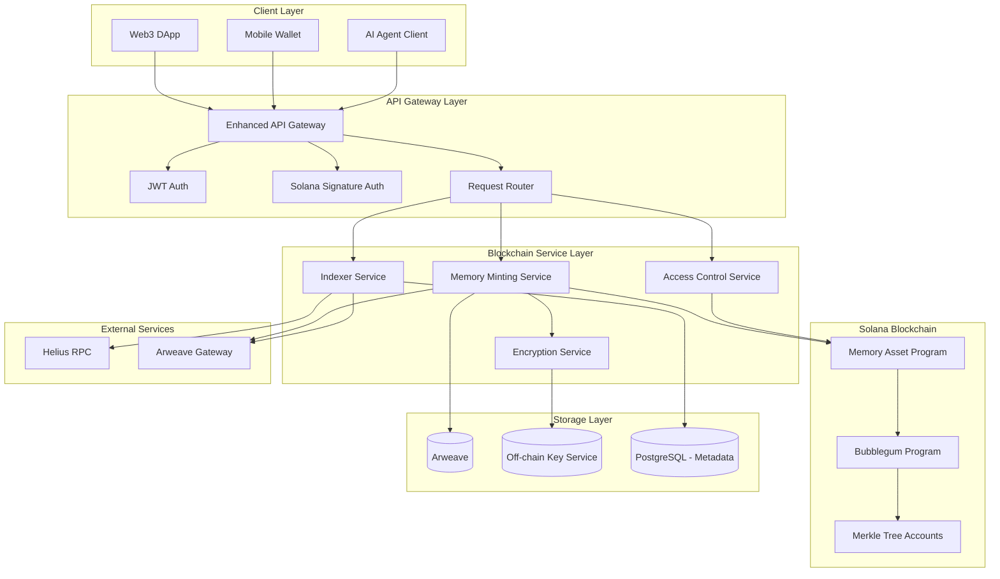
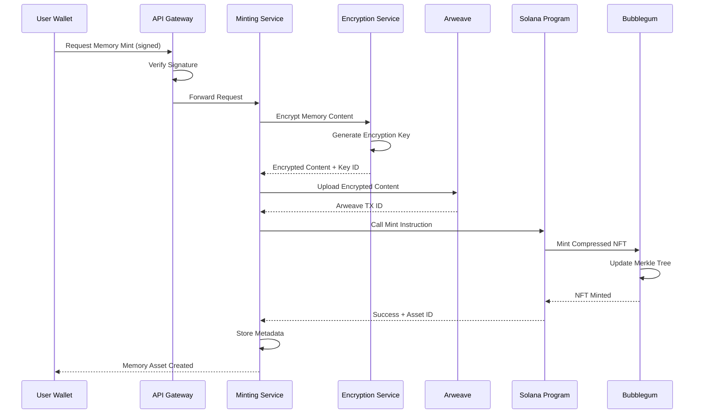
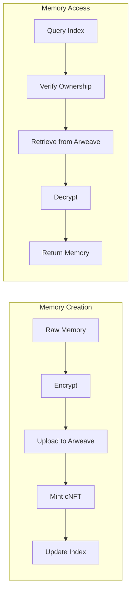

# Blockchain Memory Assets - Architecture Design

## Overview

Blockchain Memory Assets 是一个基于 Solana + 压缩 NFT (Bubblegum) + Arweave 的链上记忆资产化方案，将 AI Agent 的记忆数据转化为可验证、可交易的个人数字资产。系统采用 Solana 的高吞吐低延迟特性，结合 Metaplex Bubblegum 压缩 NFT 技术实现极低成本（<0.0001 SOL/记忆）的大规模记忆上链，并使用 Arweave 进行永久性加密存储。

### Core Design Principles

1. **极低成本**: 使用压缩 NFT 将铸造成本降低至传统 NFT 的 1/1000
2. **高吞吐量**: 支持每秒 100+ 记忆上链，满足实时记忆流需求
3. **永久存储**: Arweave 确保记忆数据永不丢失
4. **隐私优先**: 端到端加密，链下密钥管理
5. **真正所有权**: 用户完全控制记忆资产的访问和转移

## Architecture

### System Architecture Diagram



### Memory Minting Flow



### Data Flow Architecture



## Components and Interfaces

### 1. Solana Program (Rust/Anchor)

**Responsibility**: 链上记忆资产管理、访问控制、版本管理

**Program Structure**:
```rust
// programs/memory-asset/src/lib.rs
use anchor_lang::prelude::*;

#[program]
pub mod memory_asset {
    pub fn initialize_user(ctx: Context<InitializeUser>) -> Result<()>;
    pub fn mint_memory(ctx: Context<MintMemory>, params: MintParams) -> Result<()>;
    pub fn update_access_policy(ctx: Context<UpdatePolicy>, policy: AccessPolicy) -> Result<()>;
    pub fn transfer_memory(ctx: Context<TransferMemory>, new_owner: Pubkey) -> Result<()>;
    pub fn create_version(ctx: Context<CreateVersion>, params: VersionParams) -> Result<()>;
}

#[account]
pub struct UserAccount {
    pub owner: Pubkey,
    pub access_policy: AccessPolicy,
    pub memory_count: u64,
    pub created_at: i64,
}

#[account]
pub struct MemoryAsset {
    pub owner: Pubkey,
    pub arweave_id: String,
    pub version: u32,
    pub created_at: i64,
    pub updated_at: i64,
    pub metadata_uri: String,
}
```

**Key Instructions**:

- `initialize_user`: 初始化用户账户和访问策略
- `mint_memory`: 铸造记忆资产（调用 Bubblegum）
- `update_access_policy`: 更新访问控制列表
- `transfer_memory`: 转移记忆资产所有权
- `create_version`: 创建记忆新版本

### 2. Memory Minting Service

**Responsibility**: 协调记忆上链流程，处理加密、存储和铸造

**Key Components**:
- Batch Manager: 批次管理器
- Arweave Uploader: Arweave 上传器
- Solana Transaction Builder: 交易构建器
- Queue Processor: 异步队列处理器

**Interfaces**:
```typescript
interface MemoryMintingService {
  // 单条记忆上链
  mintMemory(request: MintRequest): Promise<MintResult>;
  
  // 批量记忆上链
  mintBatch(memories: MemoryInput[]): Promise<BatchMintResult>;
  
  // 查询上链状态
  getMintStatus(requestId: string): Promise<MintStatus>;
  
  // 估算成本
  estimateCost(memoryCount: number): Promise<CostEstimate>;
}

interface MintRequest {
  walletAddress: string;
  signature: string;
  memory: {
    content: string;
    metadata: Record<string, any>;
    agentId: string;
    timestamp: Date;
  };
  options?: {
    priority: 'low' | 'medium' | 'high';
    batch: boolean;
  };
}

interface MintResult {
  assetId: string;
  arweaveId: string;
  transactionSignature: string;
  cost: number;
  timestamp: Date;
}

interface BatchMintResult {
  batchId: string;
  assetIds: string[];
  totalCost: number;
  successCount: number;
  failedCount: number;
}
```

### 3. Encryption Service

**Responsibility**: 记忆内容加密解密、密钥管理

**Key Components**:
- Key Derivation: 密钥派生（基于钱包签名）
- Encryption Engine: AES-256-GCM 加密引擎
- Key Rotation Manager: 密钥轮换管理器
- Secure Key Store: 安全密钥存储（HSM 或 KMS）

**Interfaces**:
```typescript
interface EncryptionService {
  // 加密记忆内容
  encrypt(content: string, walletAddress: string): Promise<EncryptedData>;
  
  // 解密记忆内容
  decrypt(encryptedData: EncryptedData, walletAddress: string, signature: string): Promise<string>;
  
  // 生成用户主密钥
  generateMasterKey(walletAddress: string): Promise<string>;
  
  // 密钥轮换
  rotateKey(walletAddress: string): Promise<void>;
  
  // 为转移重新加密
  reencryptForTransfer(encryptedData: EncryptedData, newOwner: string): Promise<EncryptedData>;
}

interface EncryptedData {
  ciphertext: string;
  iv: string;
  authTag: string;
  keyId: string;
  algorithm: 'AES-256-GCM';
}
```

### 4. Access Control Service

**Responsibility**: 管理记忆访问权限、验证授权

**Key Components**:
- Policy Manager: 策略管理器
- Signature Verifier: 签名验证器
- ACL Cache: 访问控制列表缓存
- Audit Logger: 审计日志记录器

**Interfaces**:
```typescript
interface AccessControlService {
  // 检查访问权限
  checkAccess(assetId: string, walletAddress: string, signature: string): Promise<boolean>;
  
  // 授予访问权限
  grantAccess(assetId: string, grantee: string, policy: AccessGrant): Promise<void>;
  
  // 撤销访问权限
  revokeAccess(assetId: string, grantee: string): Promise<void>;
  
  // 获取访问策略
  getAccessPolicy(assetId: string): Promise<AccessPolicy>;
  
  // 更新访问策略
  updateAccessPolicy(assetId: string, policy: AccessPolicy): Promise<void>;
}

interface AccessPolicy {
  owner: string;
  allowList: AccessGrant[];
  defaultPolicy: 'deny' | 'allow';
}

interface AccessGrant {
  grantee: string;
  permissions: ('read' | 'write' | 'transfer')[];
  expiresAt?: Date;
  maxAccess?: number;
  currentAccess?: number;
}
```

### 5. Indexer Service

**Responsibility**: 索引链上数据、提供快速查询

**Key Components**:
- Event Listener: 事件监听器（监听 Solana 事件）
- Data Indexer: 数据索引器
- Query Engine: 查询引擎
- Cache Layer: 缓存层（Redis）

**Interfaces**:
```typescript
interface IndexerService {
  // 查询用户的记忆资产
  getUserMemories(walletAddress: string, filters?: MemoryFilter): Promise<MemoryAsset[]>;
  
  // 查询单个记忆资产
  getMemoryAsset(assetId: string): Promise<MemoryAsset | null>;
  
  // 查询批次信息
  getBatchInfo(batchId: string): Promise<BatchInfo>;
  
  // 查询转移历史
  getTransferHistory(assetId: string): Promise<TransferRecord[]>;
  
  // 同步链上数据
  syncFromChain(fromSlot?: number): Promise<void>;
}

interface MemoryFilter {
  agentId?: string;
  startDate?: Date;
  endDate?: Date;
  limit?: number;
  offset?: number;
}

interface MemoryAsset {
  assetId: string;
  owner: string;
  arweaveId: string;
  version: number;
  createdAt: Date;
  updatedAt: Date;
  metadata: Record<string, any>;
  batchId?: string;
}
```

### 6. Solana Signature Auth Middleware

**Responsibility**: 验证 Solana 钱包签名进行身份认证

**Implementation**:
```typescript
interface SolanaAuthMiddleware {
  // 验证签名
  verifySignature(req: Request): Promise<AuthResult>;
  
  // 生成挑战消息
  generateChallenge(walletAddress: string): Promise<Challenge>;
  
  // 验证挑战响应
  verifyChallenge(challenge: Challenge, signature: string): Promise<boolean>;
}

interface Challenge {
  message: string;
  nonce: string;
  timestamp: number;
  expiresAt: number;
}

interface AuthResult {
  valid: boolean;
  walletAddress?: string;
  error?: string;
}

// Express Middleware
async function solanaAuthMiddleware(req: Request, res: Response, next: NextFunction) {
  const signature = req.headers['x-solana-signature'];
  const walletAddress = req.headers['x-wallet-address'];
  const message = req.headers['x-signed-message'];
  
  if (!signature || !walletAddress || !message) {
    return res.status(401).json({ error: 'Missing authentication headers' });
  }
  
  const result = await verifySignature(message, signature, walletAddress);
  
  if (!result.valid) {
    return res.status(401).json({ error: 'Invalid signature' });
  }
  
  req.user = { walletAddress };
  next();
}
```

### 7. Arweave Integration

**Responsibility**: 上传和检索 Arweave 数据

**Key Components**:
- Upload Manager: 上传管理器
- Transaction Builder: 交易构建器
- Gateway Client: 网关客户端
- Retry Handler: 重试处理器

**Interfaces**:
```typescript
interface ArweaveService {
  // 上传数据
  upload(data: Buffer, tags: ArweaveTag[]): Promise<ArweaveUploadResult>;
  
  // 批量上传
  uploadBatch(items: ArweaveUploadItem[]): Promise<ArweaveUploadResult[]>;
  
  // 检索数据
  retrieve(transactionId: string): Promise<Buffer>;
  
  // 查询交易状态
  getTransactionStatus(transactionId: string): Promise<TransactionStatus>;
  
  // 估算成本
  estimateUploadCost(dataSize: number): Promise<number>;
}

interface ArweaveTag {
  name: string;
  value: string;
}

interface ArweaveUploadItem {
  data: Buffer;
  tags: ArweaveTag[];
}

interface ArweaveUploadResult {
  id: string;
  status: 'pending' | 'confirmed';
  cost: number;
}
```

## Data Models

### On-Chain Data Models (Solana)

```rust
// User Account (PDA)
#[account]
pub struct UserAccount {
    pub owner: Pubkey,              // 32 bytes
    pub access_policy_version: u32, // 4 bytes
    pub memory_count: u64,          // 8 bytes
    pub total_storage_bytes: u64,   // 8 bytes
    pub created_at: i64,            // 8 bytes
    pub bump: u8,                   // 1 byte
}

// Memory Asset Metadata (stored in Merkle tree leaf)
pub struct MemoryMetadata {
    pub owner: Pubkey,
    pub arweave_id: String,
    pub version: u32,
    pub batch_id: Option<String>,
    pub created_at: i64,
    pub content_hash: [u8; 32],
}

// Access Policy (PDA)
#[account]
pub struct AccessPolicyAccount {
    pub owner: Pubkey,
    pub grants: Vec<AccessGrant>,
    pub default_policy: u8, // 0 = deny, 1 = allow
    pub updated_at: i64,
}

#[derive(AnchorSerialize, AnchorDeserialize, Clone)]
pub struct AccessGrant {
    pub grantee: Pubkey,
    pub permissions: u8, // bitmap: read=1, write=2, transfer=4
    pub expires_at: Option<i64>,
    pub max_access: Option<u32>,
    pub current_access: u32,
}
```

### Off-Chain Data Models (PostgreSQL)

```sql
-- 记忆资产索引表
CREATE TABLE memory_assets (
  asset_id VARCHAR(64) PRIMARY KEY,
  owner_address VARCHAR(44) NOT NULL,
  arweave_id VARCHAR(64) NOT NULL,
  version INTEGER NOT NULL DEFAULT 1,
  batch_id VARCHAR(64),
  content_hash VARCHAR(64) NOT NULL,
  encryption_key_id VARCHAR(64) NOT NULL,
  created_at TIMESTAMP NOT NULL,
  updated_at TIMESTAMP NOT NULL,
  metadata JSONB,
  INDEX idx_owner (owner_address),
  INDEX idx_batch (batch_id),
  INDEX idx_created (created_at DESC)
);

-- 批次信息表
CREATE TABLE memory_batches (
  batch_id VARCHAR(64) PRIMARY KEY,
  owner_address VARCHAR(44) NOT NULL,
  memory_count INTEGER NOT NULL,
  total_size_bytes BIGINT NOT NULL,
  merkle_tree_address VARCHAR(44) NOT NULL,
  transaction_signature VARCHAR(88) NOT NULL,
  total_cost_lamports BIGINT NOT NULL,
  status VARCHAR(20) NOT NULL,
  created_at TIMESTAMP NOT NULL,
  confirmed_at TIMESTAMP,
  INDEX idx_owner_batch (owner_address, created_at DESC)
);

-- 访问授权表
CREATE TABLE access_grants (
  id SERIAL PRIMARY KEY,
  asset_id VARCHAR(64) NOT NULL REFERENCES memory_assets(asset_id),
  grantee_address VARCHAR(44) NOT NULL,
  permissions VARCHAR(20)[] NOT NULL,
  expires_at TIMESTAMP,
  max_access INTEGER,
  current_access INTEGER DEFAULT 0,
  created_at TIMESTAMP NOT NULL,
  revoked_at TIMESTAMP,
  INDEX idx_asset_grantee (asset_id, grantee_address)
);

-- 转移历史表
CREATE TABLE transfer_history (
  id SERIAL PRIMARY KEY,
  asset_id VARCHAR(64) NOT NULL REFERENCES memory_assets(asset_id),
  from_address VARCHAR(44) NOT NULL,
  to_address VARCHAR(44) NOT NULL,
  transaction_signature VARCHAR(88) NOT NULL,
  transferred_at TIMESTAMP NOT NULL,
  INDEX idx_asset_transfer (asset_id, transferred_at DESC)
);

-- 上链队列表
CREATE TABLE minting_queue (
  id SERIAL PRIMARY KEY,
  request_id VARCHAR(64) UNIQUE NOT NULL,
  owner_address VARCHAR(44) NOT NULL,
  memory_content TEXT NOT NULL,
  metadata JSONB,
  priority VARCHAR(10) NOT NULL DEFAULT 'medium',
  status VARCHAR(20) NOT NULL DEFAULT 'pending',
  batch_id VARCHAR(64),
  retry_count INTEGER DEFAULT 0,
  error_message TEXT,
  created_at TIMESTAMP NOT NULL,
  processed_at TIMESTAMP,
  INDEX idx_status_priority (status, priority, created_at)
);

-- 审计日志表
CREATE TABLE blockchain_audit_logs (
  id SERIAL PRIMARY KEY,
  wallet_address VARCHAR(44) NOT NULL,
  action VARCHAR(50) NOT NULL,
  asset_id VARCHAR(64),
  transaction_signature VARCHAR(88),
  details JSONB,
  ip_address INET,
  timestamp TIMESTAMP NOT NULL,
  INDEX idx_wallet_action (wallet_address, action, timestamp DESC)
);
```

### Arweave Data Structure

```typescript
// 存储在 Arweave 上的加密记忆数据
interface ArweaveMemoryData {
  version: '1.0';
  encrypted: {
    content: string;        // Base64 encoded encrypted content
    iv: string;            // Initialization vector
    authTag: string;       // Authentication tag
    algorithm: 'AES-256-GCM';
  };
  metadata: {
    agentId: string;
    timestamp: string;
    contentType: string;
    originalSize: number;
  };
  tags: ArweaveTag[];
}

// Arweave Tags
const tags = [
  { name: 'App-Name', value: 'MemoryPlatform' },
  { name: 'Content-Type', value: 'application/json' },
  { name: 'Memory-Type', value: 'episodic' },
  { name: 'Agent-ID', value: agentId },
  { name: 'Owner', value: walletAddress },
  { name: 'Version', value: '1' },
  { name: 'Encrypted', value: 'true' },
];
```

## Integration with Existing Platform

### Enhanced API Gateway

在现有 API Gateway 中添加区块链相关路由：

```typescript
// services/api-gateway/src/routes/blockchain.ts
import express from 'express';
import { solanaAuthMiddleware } from '../middleware/solana-auth';

const router = express.Router();

// 记忆上链
router.post('/v1/blockchain/memories/mint', 
  solanaAuthMiddleware,
  async (req, res) => {
    // Mint memory as cNFT
  }
);

// 批量上链
router.post('/v1/blockchain/memories/mint-batch',
  solanaAuthMiddleware,
  async (req, res) => {
    // Batch mint memories
  }
);

// 查询链上记忆
router.get('/v1/blockchain/memories',
  solanaAuthMiddleware,
  async (req, res) => {
    // Query user's on-chain memories
  }
);

// 授予访问权限
router.post('/v1/blockchain/memories/:assetId/grant',
  solanaAuthMiddleware,
  async (req, res) => {
    // Grant access to memory
  }
);

// 转移记忆资产
router.post('/v1/blockchain/memories/:assetId/transfer',
  solanaAuthMiddleware,
  async (req, res) => {
    // Transfer memory asset
  }
);

export default router;
```

### Memory Service Integration

扩展现有 Memory Service 以支持区块链功能：

```typescript
// services/memory-service/src/blockchain-adapter.ts
export class BlockchainMemoryAdapter {
  constructor(
    private mintingService: MemoryMintingService,
    private encryptionService: EncryptionService,
    private indexerService: IndexerService
  ) {}
  
  async storeMemoryOnChain(memory: MemoryRecord, walletAddress: string): Promise<string> {
    // 1. Encrypt memory
    const encrypted = await this.encryptionService.encrypt(
      JSON.stringify(memory),
      walletAddress
    );
    
    // 2. Upload to Arweave
    const arweaveId = await this.uploadToArweave(encrypted);
    
    // 3. Mint cNFT
    const result = await this.mintingService.mintMemory({
      walletAddress,
      memory: {
        content: memory.content,
        metadata: memory.metadata,
        agentId: memory.agentId,
        timestamp: memory.timestamp
      }
    });
    
    return result.assetId;
  }
  
  async retrieveMemoryFromChain(assetId: string, walletAddress: string, signature: string): Promise<MemoryRecord> {
    // 1. Verify access
    const hasAccess = await this.accessControl.checkAccess(assetId, walletAddress, signature);
    if (!hasAccess) {
      throw new Error('Access denied');
    }
    
    // 2. Get asset info from indexer
    const asset = await this.indexerService.getMemoryAsset(assetId);
    
    // 3. Retrieve from Arweave
    const encryptedData = await this.arweave.retrieve(asset.arweaveId);
    
    // 4. Decrypt
    const decrypted = await this.encryptionService.decrypt(
      encryptedData,
      walletAddress,
      signature
    );
    
    return JSON.parse(decrypted);
  }
}
```

## Technology Stack

### Blockchain

- **Blockchain**: Solana (Mainnet-beta / Devnet)
- **Smart Contract Framework**: Anchor 0.29+
- **Language**: Rust 1.70+
- **Compressed NFT**: Metaplex Bubblegum
- **RPC Provider**: Helius / QuickNode / Self-hosted
- **Wallet Integration**: @solana/wallet-adapter

### Storage

- **Permanent Storage**: Arweave
- **Arweave SDK**: arweave-js
- **Upload Service**: Bundlr Network (for instant uploads)

### Backend Services

- **Language**: TypeScript / Node.js
- **Blockchain SDK**: @solana/web3.js, @metaplex-foundation/mpl-bubblegum
- **Encryption**: Node.js crypto module (AES-256-GCM)
- **Queue**: Bull (Redis-based)
- **Database**: PostgreSQL (indexer data)
- **Cache**: Redis

### Development Tools

- **Solana CLI**: solana-cli
- **Anchor CLI**: anchor-cli
- **Testing**: Anchor test framework, Bankrun
- **Local Validator**: solana-test-validator

## Performance Optimization

### Batch Processing Strategy

```typescript
class BatchManager {
  private queue: MemoryInput[] = [];
  private batchSize = 50;
  private batchTimeout = 5000; // 5 seconds
  private timer: NodeJS.Timeout | null = null;
  
  async addToBatch(memory: MemoryInput): Promise<void> {
    this.queue.push(memory);
    
    if (this.queue.length >= this.batchSize) {
      await this.processBatch();
    } else if (!this.timer) {
      this.timer = setTimeout(() => this.processBatch(), this.batchTimeout);
    }
  }
  
  private async processBatch(): Promise<void> {
    if (this.timer) {
      clearTimeout(this.timer);
      this.timer = null;
    }
    
    if (this.queue.length === 0) return;
    
    const batch = this.queue.splice(0, this.batchSize);
    await this.mintingService.mintBatch(batch);
  }
}
```

### Caching Strategy

- **Indexer Cache**: Redis 缓存查询结果（TTL: 60s）
- **Access Policy Cache**: Redis 缓存访问策略（TTL: 300s）
- **Arweave Gateway Cache**: CDN 缓存常访问内容

### Cost Optimization

```typescript
interface CostOptimizer {
  // 动态调整批次大小
  adjustBatchSize(networkCongestion: number): number;
  
  // 选择最优 RPC 节点
  selectOptimalRPC(): string;
  
  // 计算最优优先费用
  calculatePriorityFee(urgency: 'low' | 'medium' | 'high'): number;
}
```

## Security Considerations

### Encryption

- **Algorithm**: AES-256-GCM
- **Key Derivation**: PBKDF2 (100,000 iterations) from wallet signature
- **IV**: Random 12 bytes per encryption
- **Auth Tag**: 16 bytes for integrity verification

### Key Management

```typescript
interface KeyManagementService {
  // 生成用户主密钥
  generateMasterKey(walletAddress: string, signature: string): Promise<MasterKey>;
  
  // 派生内容加密密钥
  deriveContentKey(masterKey: MasterKey, contentId: string): Promise<ContentKey>;
  
  // 安全存储（使用 HSM 或 AWS KMS）
  storeKey(keyId: string, encryptedKey: Buffer): Promise<void>;
  
  // 密钥轮换
  rotateKeys(walletAddress: string): Promise<void>;
}
```

### Access Control

- **Signature Verification**: Ed25519 签名验证
- **Replay Attack Prevention**: Nonce + Timestamp
- **Rate Limiting**: 每个钱包地址限流
- **Audit Logging**: 所有访问记录审计日志

## Error Handling

### Blockchain Errors

```typescript
enum BlockchainErrorCode {
  INSUFFICIENT_FUNDS = 'INSUFFICIENT_FUNDS',
  TRANSACTION_FAILED = 'TRANSACTION_FAILED',
  INVALID_SIGNATURE = 'INVALID_SIGNATURE',
  MERKLE_TREE_FULL = 'MERKLE_TREE_FULL',
  ARWEAVE_UPLOAD_FAILED = 'ARWEAVE_UPLOAD_FAILED',
  ENCRYPTION_FAILED = 'ENCRYPTION_FAILED',
  ACCESS_DENIED = 'ACCESS_DENIED',
}

class BlockchainError extends Error {
  constructor(
    public code: BlockchainErrorCode,
    message: string,
    public details?: any
  ) {
    super(message);
  }
}
```

### Retry Strategy

- **Transient Errors**: Exponential backoff (1s, 2s, 4s, 8s)
- **Network Errors**: Switch to backup RPC
- **Arweave Errors**: Retry with different gateway
- **Max Retries**: 3 attempts

## Monitoring & Observability

### Key Metrics

**Blockchain Metrics**:
- Transaction success rate
- Average confirmation time
- Gas cost per transaction
- Merkle tree utilization

**Storage Metrics**:
- Arweave upload success rate
- Average upload time
- Storage cost per MB
- Data retrieval latency

**Business Metrics**:
- Memories minted per day
- Active wallet addresses
- Total storage used
- Revenue from minting fees

### Alerting

- Transaction failure rate > 5%
- Arweave upload failure rate > 2%
- RPC response time > 2s
- Merkle tree > 90% full
- Encryption service errors

## Testing Strategy

### Unit Tests

- Solana Program instructions
- Encryption/Decryption logic
- Signature verification
- Access control logic

### Integration Tests

- End-to-end minting flow
- Arweave upload and retrieval
- Indexer synchronization
- Access grant and revoke

### Load Tests

- 100 concurrent minting requests
- 1000 memories in batch
- Sustained load for 1 hour

## Deployment

### Solana Program Deployment

```bash
# Build program
anchor build

# Deploy to devnet
anchor deploy --provider.cluster devnet

# Verify deployment
solana program show <PROGRAM_ID>

# Deploy to mainnet
anchor deploy --provider.cluster mainnet-beta
```

### Service Deployment

```yaml
# docker-compose.blockchain.yml
services:
  blockchain-minting-service:
    build: ./services/blockchain-minting-service
    environment:
      - SOLANA_RPC_URL=${SOLANA_RPC_URL}
      - PROGRAM_ID=${MEMORY_ASSET_PROGRAM_ID}
      - ARWEAVE_WALLET=${ARWEAVE_WALLET}
    depends_on:
      - postgres
      - redis
  
  blockchain-indexer-service:
    build: ./services/blockchain-indexer-service
    environment:
      - HELIUS_API_KEY=${HELIUS_API_KEY}
      - PROGRAM_ID=${MEMORY_ASSET_PROGRAM_ID}
```

## Cost Analysis

### Per-Memory Cost Breakdown

- **Compressed NFT Mint**: ~0.00005 SOL (~$0.005)
- **Arweave Storage (1KB)**: ~0.00001 AR (~$0.0003)
- **Transaction Fee**: ~0.000005 SOL (~$0.0005)
- **Total**: ~$0.006 per memory

### Comparison with Traditional NFT

- **Traditional NFT**: ~0.01 SOL (~$1.00)
- **Compressed NFT**: ~0.00005 SOL (~$0.005)
- **Cost Reduction**: 99.5%

### Scalability

- **Merkle Tree Capacity**: 1,000,000 memories per tree
- **Tree Creation Cost**: ~0.1 SOL
- **Amortized Cost**: ~0.0001 SOL per memory
