# MemLayer 项目架构图

**最后更新**: 2024-11-02

## 系统概览

MemLayer 是一个**企业级 AI Agent 记忆平台**，提供完整的记忆管理、高级检索、区块链资产化和实时可视化能力。

### 核心模块
- 🧠 **记忆管理系统**：STM、Episodic、Semantic、Reflection 四种记忆类型
- 🔍 **高级检索系统**：向量搜索、知识图谱、混合策略、RAG 工作流
- ⛓️ **区块链资产化**：Solana + cNFT + Arweave，极低成本上链
- 📊 **实时可视化**：时间线、图谱、列表、统计四种视图
- 💬 **智能聊天界面**：集成所有功能的统一交互界面
- 🛠️ **完整工具链**：SDK（TypeScript/Rust）、CLI、前端界面

### 技术架构
- **微服务架构**：7 个核心服务 + 5 个区块链服务
- **多数据库**：PostgreSQL、Qdrant、Neo4j、Redis、TimescaleDB
- **区块链**：Solana 智能合约、Metaplex Bubblegum、Arweave 存储
- **实时通信**：WebSocket 服务器、事件驱动更新
- **前端应用**：3 个完整的 React 应用（聊天界面、可视化、区块链前端）

---

## 整体系统架构

```mermaid
graph TB
    subgraph "客户端层 Client Layer"
        A1[聊天界面<br/>Chat Interface]
        A2[可视化前端<br/>Visualization UI]
        A3[区块链前端<br/>Blockchain UI]
        A4[AI Agent 应用<br/>Agent Apps]
        A5[第三方服务<br/>3rd Party]
        A6[CLI 工具<br/>CLI Tools]
    end

    subgraph "API 网关层 API Gateway"
        B1[API Gateway<br/>统一入口]
        B2[JWT 认证<br/>Authentication]
        B3[RBAC 授权<br/>Authorization]
        B4[限流保护<br/>Rate Limiting]
        B5[路由分发<br/>Routing]
        B6[Solana 认证<br/>Wallet Auth]
    end

    subgraph "核心服务层 Core Services"
        C1[Memory Service<br/>记忆管理]
        C2[Embedding Service<br/>向量生成]
        C3[Retrieval Service<br/>检索服务]
        C4[Reflection Service<br/>反思机制]
        C5[Management Service<br/>生命周期管理]
        C6[Visualization Service<br/>可视化服务]
    end

    subgraph "区块链服务层 Blockchain Services"
        D1[Minting Service<br/>铸造服务]
        D2[Encryption Service<br/>加密服务]
        D3[Indexer Service<br/>索引服务]
        D4[Access Control<br/>访问控制]
        D5[Arweave Service<br/>存储服务]
    end

    subgraph "记忆引擎层 Memory Engines"
        E1[STM Engine<br/>短期记忆]
        E2[Episodic Engine<br/>情景记忆]
        E3[Semantic Engine<br/>语义记忆]
        E4[RAG Engine<br/>检索增强]
    end

    subgraph "区块链层 Blockchain Layer"
        F1[Solana Program<br/>智能合约]
        F2[Metaplex Bubblegum<br/>压缩 NFT]
        F3[Arweave Network<br/>永久存储]
        F4[RPC Load Balancer<br/>负载均衡]
    end

    subgraph "存储层 Storage Layer"
        G1[(PostgreSQL<br/>关系数据)]
        G2[(Qdrant<br/>向量数据)]
        G3[(Neo4j<br/>知识图谱)]
        G4[(Redis<br/>缓存/STM)]
        G5[(TimescaleDB<br/>时序数据)]
        G6[(Blockchain DB<br/>链上数据)]
    end

    subgraph "外部服务 External Services"
        H1[OpenAI API<br/>嵌入/LLM]
        H2[Solana RPC<br/>区块链节点]
        H3[Arweave Gateway<br/>存储网关]
    end

    subgraph "监控层 Monitoring & DevOps"
        I1[Prometheus<br/>指标收集]
        I2[Grafana<br/>可视化]
        I3[Jaeger<br/>链路追踪]
        I4[Docker<br/>容器化]
    end

    A1 & A2 & A3 & A4 & A5 & A6 --> B1
    B1 --> B2 & B3 & B4 & B5 & B6
    B5 --> C1 & C2 & C3 & C4 & C5 & C6
    B5 --> D1 & D2 & D3 & D4 & D5
    
    C1 --> E1 & E2 & E3
    C3 --> E4
    C6 --> C1
    
    D1 --> D2 & D5
    D1 --> F1 & F4
    D3 --> F1 & F4
    D4 --> F1
    
    E1 --> G4
    E2 --> G1 & G2
    E3 --> G2 & G3
    E4 --> G2 & G3
    C6 --> G4
    D3 --> G6
    
    F1 --> F2
    D5 --> F3
    F4 --> H2
    
    C2 --> H1
    C4 --> H1
    D5 --> H3
    
    C1 & C2 & C3 & C4 & C5 & C6 --> I1
    D1 & D2 & D3 & D4 & D5 --> I1
    I1 --> I2
    I1 --> I3

    style A1 fill:#e1f5ff
    style A2 fill:#e1f5ff
    style A3 fill:#e1f5ff
    style A4 fill:#e1f5ff
    style A5 fill:#e1f5ff
    style A6 fill:#e1f5ff
    style B1 fill:#fff4e6
    style C1 fill:#e8f5e9
    style C2 fill:#e8f5e9
    style C3 fill:#e8f5e9
    style C4 fill:#e8f5e9
    style C5 fill:#e8f5e9
    style C6 fill:#e8f5e9
    style D1 fill:#f3e5f5
    style D2 fill:#f3e5f5
    style D3 fill:#f3e5f5
    style D4 fill:#f3e5f5
    style D5 fill:#f3e5f5
    style F1 fill:#ffe0b2
    style F2 fill:#ffe0b2
    style F3 fill:#ffe0b2
    style F4 fill:#ffe0b2
```

## 完整系统架构（包含前端应用）

```mermaid
graph TB
    subgraph "前端应用层 Frontend Applications"
        FE1[聊天界面<br/>Chat Interface<br/>React + Zustand + D3.js]
        FE2[记忆可视化<br/>Memory Visualization<br/>React + D3.js + Recharts]
        FE3[区块链前端<br/>Blockchain Frontend<br/>React + Solana Wallet]
        FE4[可视化 Demo<br/>Visualization Demo<br/>React + Mock Data]
        FE5[区块链 Demo<br/>Blockchain Demo<br/>React + Wallet Adapter]
    end

    subgraph "WebSocket 实时通信"
        WS1[Visualization WebSocket<br/>记忆更新推送]
        WS2[Chat WebSocket<br/>对话实时通信]
    end

    subgraph "API 网关 + 路由"
        GW[API Gateway<br/>:3000]
        R1[/v1/memories/*<br/>记忆管理]
        R2[/v1/agents/*<br/>Agent 管理]
        R3[/v1/rag/*<br/>RAG 检索]
        R4[/v1/blockchain/*<br/>区块链操作]
        R5[/v1/visualization/*<br/>可视化数据]
    end

    subgraph "核心服务 Core Services"
        S1[Memory Service<br/>:3001]
        S2[Embedding Service<br/>:3002]
        S3[Retrieval Service<br/>:3003]
        S4[Reflection Service<br/>:3004]
        S5[Management Service<br/>:3005]
        S6[Visualization Service<br/>:3006]
    end

    subgraph "区块链服务 Blockchain Services"
        BS1[Minting Service<br/>铸造协调]
        BS2[Encryption Service<br/>端到端加密]
        BS3[Indexer Service<br/>链上索引]
        BS4[Access Control<br/>访问控制]
        BS5[Arweave Service<br/>永久存储]
        BS6[RPC Load Balancer<br/>负载均衡]
    end

    subgraph "SDK & 工具 SDK & Tools"
        SDK1[TypeScript SDK<br/>完整实现]
        SDK2[Rust SDK<br/>高性能]
        CLI[CLI Tools<br/>命令行工具]
    end

    subgraph "数据存储 Data Storage"
        DB1[(PostgreSQL<br/>元数据)]
        DB2[(Qdrant<br/>向量)]
        DB3[(Neo4j<br/>图谱)]
        DB4[(Redis<br/>缓存)]
        DB5[(Blockchain DB<br/>链上数据)]
    end

    subgraph "区块链基础设施 Blockchain Infrastructure"
        BC1[Solana Program<br/>Memory Asset]
        BC2[Metaplex Bubblegum<br/>cNFT]
        BC3[Arweave<br/>永久存储]
    end

    FE1 --> WS2
    FE1 --> GW
    FE2 --> WS1
    FE2 --> GW
    FE3 --> GW
    FE3 --> SDK1
    FE4 --> WS1
    FE5 --> SDK1
    
    WS1 --> S6
    WS2 --> GW
    
    GW --> R1 & R2 & R3 & R4 & R5
    R1 --> S1
    R2 --> S5
    R3 --> S3
    R4 --> BS1 & BS3 & BS4
    R5 --> S6
    
    S1 --> S2 & S3 & S4
    S6 --> S1
    
    BS1 --> BS2 & BS5 & BS6
    BS3 --> BS6
    BS4 --> BS6
    
    SDK1 --> GW
    SDK2 --> GW
    CLI --> SDK1
    
    S1 & S2 & S3 --> DB1 & DB2 & DB3 & DB4
    BS3 --> DB5
    
    BS6 --> BC1
    BS5 --> BC3
    BC1 --> BC2

    style FE1 fill:#e1bee7
    style FE2 fill:#ce93d8
    style FE3 fill:#ba68c8
    style WS1 fill:#ffccbc
    style WS2 fill:#ffab91
    style GW fill:#fff9c4
    style S1 fill:#c8e6c9
    style S2 fill:#c8e6c9
    style S3 fill:#c8e6c9
    style S4 fill:#c8e6c9
    style S5 fill:#c8e6c9
    style S6 fill:#c8e6c9
    style BS1 fill:#b3e5fc
    style BS2 fill:#b3e5fc
    style BS3 fill:#b3e5fc
    style BS4 fill:#b3e5fc
    style BS5 fill:#b3e5fc
    style BC1 fill:#ffccbc
```

## 核心服务详细架构

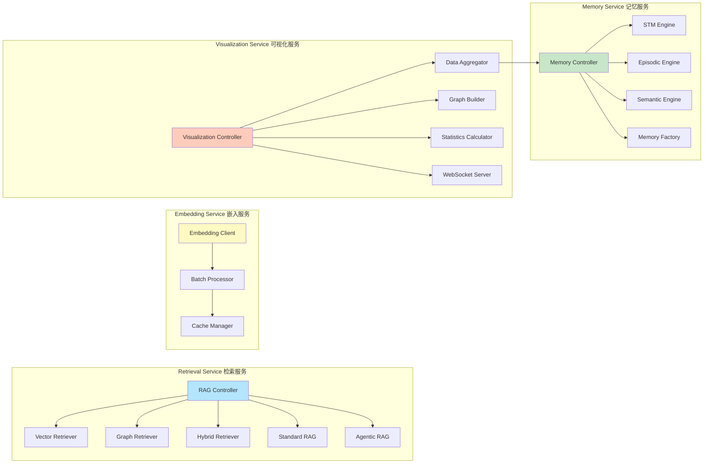

## 区块链模块架构

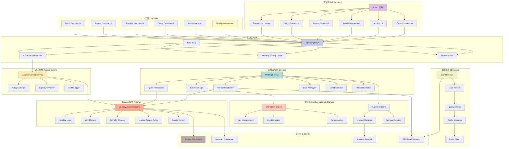

## 数据流架构

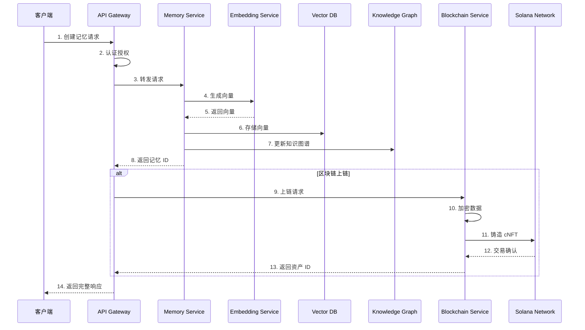

## 记忆检索流程

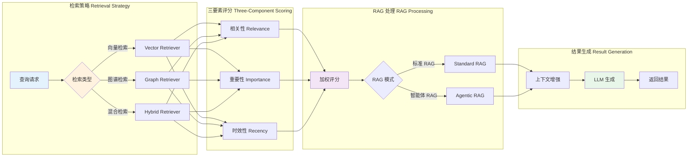

## 区块链铸造流程

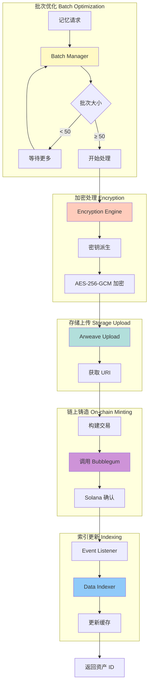

## 技术栈总览

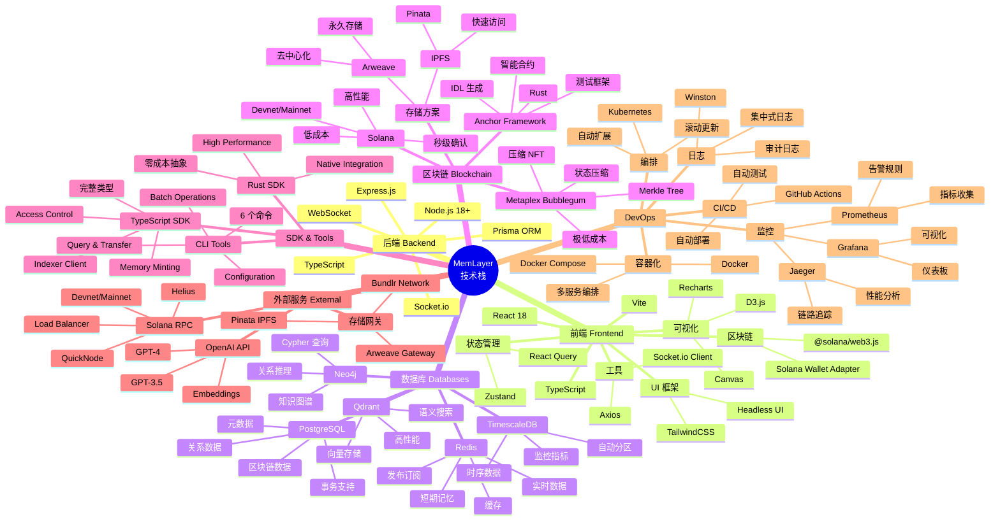

## 部署架构

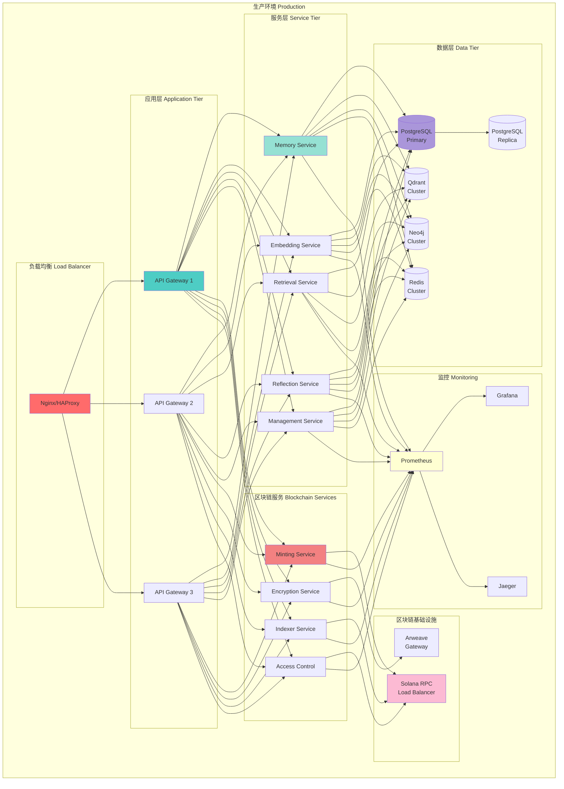

## 安全架构

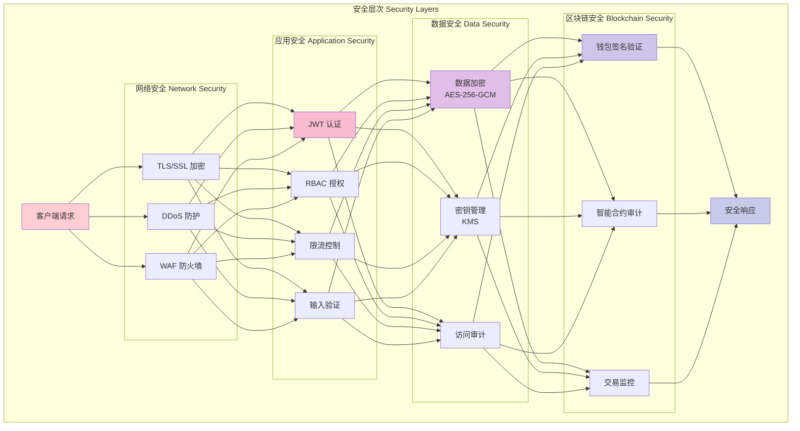

## 项目目录结构

```
agent-memory-platform/
├── 📦 packages/                    # 共享包
│   ├── shared/                     # 共享类型和工具
│   ├── database/                   # 数据库客户端 (Prisma)
│   ├── vector-db/                  # Qdrant 客户端
│   ├── knowledge-graph/            # Neo4j 客户端
│   └── cache/                      # Redis 客户端
│
├── 🔧 services/                    # 核心微服务
│   ├── api-gateway/                # API 网关 (:3000)
│   │   ├── src/routes/            # 路由定义
│   │   │   ├── agents.ts          # Agent 管理
│   │   │   ├── memories.ts        # 记忆管理
│   │   │   ├── rag.ts             # RAG 检索
│   │   │   ├── blockchain.ts      # 区块链操作
│   │   │   ├── visualization.ts   # 可视化数据
│   │   │   └── management.ts      # 生命周期管理
│   │   └── src/middleware/        # 中间件
│   │       ├── auth.ts            # JWT 认证
│   │       ├── authorization.ts   # RBAC 授权
│   │       ├── rate-limit.ts      # 限流
│   │       └── solana-auth.ts     # Solana 签名认证
│   │
│   ├── memory-service/             # 记忆管理服务 (:3001)
│   │   └── src/engines/           # 记忆引擎
│   │       ├── stm-engine.ts      # 短期记忆
│   │       ├── episodic-memory-engine.ts  # 情景记忆
│   │       └── semantic-memory-engine.ts  # 语义记忆
│   │
│   ├── embedding-service/          # 向量生成服务 (:3002)
│   │   ├── src/client.ts          # OpenAI 客户端
│   │   └── src/batch-processor.ts # 批处理
│   │
│   ├── retrieval-service/          # 检索服务 (:3003)
│   │   ├── src/retrievers/        # 检索器
│   │   │   ├── vector-retriever.ts    # 向量检索
│   │   │   ├── graph-retriever.ts     # 图谱检索
│   │   │   └── hybrid-retriever.ts    # 混合检索
│   │   └── src/rag/               # RAG 实现
│   │       ├── standard-rag.ts    # 标准 RAG
│   │       └── agentic-rag.ts     # 智能体 RAG
│   │
│   ├── reflection-service/         # 反思服务 (:3004)
│   │   └── src/reflection-engine.ts
│   │
│   ├── management-service/         # 生命周期管理 (:3005)
│   │   └── src/management-service.ts
│   │
│   └── visualization-service/      # 可视化服务 (:3006)
│       ├── src/services/          # 核心服务
│       │   ├── visualization-service.ts   # 主服务
│       │   ├── data-aggregator.ts         # 数据聚合
│       │   ├── graph-builder.ts           # 图谱构建
│       │   └── statistics-calculator.ts   # 统计计算
│       └── src/websocket-server.ts        # WebSocket 服务器
│
├── ⛓️ blockchain/                  # 区块链模块
│   ├── programs/                   # Solana 智能合约
│   │   └── memory-asset/          # 记忆资产合约 (Rust/Anchor)
│   │       ├── src/lib.rs         # 主程序
│   │       ├── src/state.rs       # 状态定义
│   │       ├── src/errors.rs      # 错误定义
│   │       ├── src/instructions/  # 指令实现
│   │       │   ├── initialize_user.rs
│   │       │   ├── mint_memory.rs
│   │       │   ├── transfer_memory.rs
│   │       │   ├── update_access_policy.rs
│   │       │   └── create_version.rs
│   │       └── tests/             # 测试
│   │
│   ├── services/                   # 区块链服务 (TypeScript)
│   │   ├── minting-service/       # 铸造服务
│   │   │   └── src/services/
│   │   │       ├── batch-manager.ts           # 批次管理
│   │   │       ├── optimized-batch-manager.ts # 优化批处理
│   │   │       ├── batch-optimizer.ts         # 批次优化器
│   │   │       ├── batch-merger.ts            # 批次合并
│   │   │       ├── minting-coordinator.ts     # 铸造协调
│   │   │       ├── transaction-builder.ts     # 交易构建
│   │   │       ├── queue-processor.ts         # 队列处理
│   │   │       ├── state-manager.ts           # 状态管理
│   │   │       └── cost-estimator.ts          # 成本估算
│   │   │
│   │   ├── encryption/            # 加密服务
│   │   │   └── src/
│   │   │       ├── encryption-engine.ts   # 加密引擎
│   │   │       ├── key-derivation.ts      # 密钥派生
│   │   │       ├── key-management.ts      # 密钥管理
│   │   │       └── reencryption.ts        # 重新加密
│   │   │
│   │   ├── indexer/               # 索引服务
│   │   │   └── src/
│   │   │       ├── services/
│   │   │       │   ├── event-listener.ts      # 事件监听
│   │   │       │   ├── data-indexer.ts        # 数据索引
│   │   │       │   ├── query-engine.ts        # 查询引擎
│   │   │       │   └── indexer-service.ts     # 主服务
│   │   │       └── cache/
│   │   │           ├── cache-manager.ts       # 缓存管理
│   │   │           └── redis-client.ts        # Redis 客户端
│   │   │
│   │   ├── access-control/        # 访问控制服务
│   │   │   └── src/services/
│   │   │       ├── access-control-service.ts  # 主服务
│   │   │       ├── policy-manager.ts          # 策略管理
│   │   │       ├── signature-verifier.ts      # 签名验证
│   │   │       └── audit-logger.ts            # 审计日志
│   │   │
│   │   ├── arweave/               # Arweave 存储服务
│   │   │   └── src/
│   │   │       ├── arweave-client.ts      # Arweave 客户端
│   │   │       ├── upload-manager.ts      # 上传管理
│   │   │       ├── retrieval-service.ts   # 检索服务
│   │   │       └── error-handler.ts       # 错误处理
│   │   │
│   │   └── shared/                # 共享工具
│   │       └── rpc-load-balancer.ts   # RPC 负载均衡
│   │
│   ├── sdk/                        # SDK
│   │   ├── typescript/            # TypeScript SDK
│   │   │   └── src/
│   │   │       ├── MemoryPlatformSDK.ts       # 主 SDK
│   │   │       ├── clients/
│   │   │       │   ├── MemoryMintingClient.ts     # 铸造客户端
│   │   │       │   ├── AccessControlClient.ts     # 访问控制客户端
│   │   │       │   └── IndexerClient.ts           # 索引客户端
│   │   │       └── types.ts                   # 类型定义
│   │   │
│   │   └── rust/                  # Rust SDK
│   │       └── src/
│   │           ├── client.rs      # 主客户端
│   │           ├── types.rs       # 类型定义
│   │           └── utils.rs       # 工具函数
│   │
│   ├── cli/                        # CLI 工具
│   │   └── src/
│   │       ├── commands/          # 命令实现
│   │       │   ├── config.ts      # 配置管理
│   │       │   ├── mint.ts        # 铸造命令
│   │       │   ├── query.ts       # 查询命令
│   │       │   ├── transfer.ts    # 转移命令
│   │       │   ├── access.ts      # 访问控制
│   │       │   └── batch.ts       # 批量操作
│   │       └── utils/
│   │           ├── api-client.ts  # API 客户端
│   │           └── display.ts     # 显示工具
│   │
│   ├── frontend/                   # 区块链前端
│   │   └── src/
│   │       ├── components/        # React 组件 (20+ 组件)
│   │       │   ├── WalletInfo.tsx
│   │       │   ├── MintMemoryForm.tsx
│   │       │   ├── BatchMintForm.tsx
│   │       │   ├── AssetList.tsx
│   │       │   ├── TransactionHistory.tsx
│   │       │   └── ...
│   │       ├── hooks/             # 自定义 Hooks
│   │       │   ├── useWalletConnection.ts
│   │       │   ├── useMemoryMinting.ts
│   │       │   └── useMemoryAssets.ts
│   │       └── contexts/
│   │           └── WalletContext.tsx
│   │
│   ├── frontend-demo/              # 区块链 Demo
│   │   └── src/
│   │       └── components/
│   │
│   ├── database/                   # 数据库
│   │   └── migrations/            # SQL 迁移
│   │       └── 001_create_blockchain_tables.sql
│   │
│   ├── config/                     # 配置系统
│   │   ├── config-loader.ts       # 配置加载器
│   │   └── examples/              # 配置示例
│   │
│   └── core/                       # 核心抽象
│       ├── blockchain-adapter.ts  # 区块链适配器
│       └── types.ts               # 类型定义
│
├── 🎨 frontend/                    # 前端应用
│   ├── chat-interface/            # 聊天界面 (:5173)
│   │   └── src/
│   │       ├── components/        # React 组件 (40+ 组件)
│   │       │   ├── MainLayout.tsx         # 主布局
│   │       │   ├── ChatPanel.tsx          # 聊天面板
│   │       │   ├── VisualizationPanel.tsx # 可视化面板
│   │       │   ├── MessageList.tsx        # 消息列表
│   │       │   ├── SessionSidebar.tsx     # 会话侧边栏
│   │       │   ├── KnowledgeGraph.tsx     # 知识图谱
│   │       │   ├── MemoryTimeline.tsx     # 记忆时间线
│   │       │   ├── BlockchainAssets.tsx   # 区块链资产
│   │       │   ├── StatisticsView.tsx     # 统计视图
│   │       │   └── ...
│   │       ├── stores/            # Zustand 状态管理
│   │       │   ├── chatStore.ts           # 聊天状态
│   │       │   ├── visualizationStore.ts  # 可视化状态
│   │       │   └── blockchainStore.ts     # 区块链状态
│   │       ├── hooks/             # 自定义 Hooks
│   │       │   ├── useQuery.ts
│   │       │   ├── useNotification.ts
│   │       │   ├── useDebounce.ts
│   │       │   ├── useThrottle.ts
│   │       │   ├── useBreakpoint.ts
│   │       │   └── useAccessibility.ts
│   │       ├── api/               # API 客户端
│   │       │   ├── websocket.ts           # WebSocket 客户端
│   │       │   └── visualization.ts       # 可视化 API
│   │       ├── contexts/
│   │       │   └── ThemeContext.tsx       # 主题上下文
│   │       └── docs/              # 文档
│   │           ├── USER_GUIDE.md
│   │           ├── DEVELOPER_GUIDE.md
│   │           ├── DEPLOYMENT_GUIDE.md
│   │           └── FAQ.md
│   │
│   ├── memory-visualization/      # 记忆可视化 (:3100)
│   │   └── src/
│   │       ├── components/        # React 组件
│   │       │   ├── Dashboard.tsx          # 仪表板
│   │       │   ├── TimelineView.tsx       # 时间线视图
│   │       │   ├── GraphView.tsx          # 图谱视图
│   │       │   ├── ListView.tsx           # 列表视图
│   │       │   ├── StatisticsView.tsx     # 统计视图
│   │       │   ├── FilterPanel.tsx        # 过滤面板
│   │       │   ├── MemoryDetailPanel.tsx  # 详情面板
│   │       │   ├── ExportButton.tsx       # 导出按钮
│   │       │   └── ErrorBoundary.tsx      # 错误边界
│   │       ├── api/
│   │       │   ├── client.ts              # API 客户端
│   │       │   └── websocket.ts           # WebSocket 客户端
│   │       └── types/
│   │           └── index.ts               # 类型定义
│   │
│   └── memory-visualization-demo/ # 可视化 Demo
│       └── src/
│           ├── components/
│           └── data/
│               └── mockData.ts            # 模拟数据
│
├── 📜 scripts/                     # 脚本
│   ├── init-db.sql                # 数据库初始化
│   ├── start.sh                   # 启动脚本
│   ├── setup-solana-dev.sh        # Solana 环境设置
│   └── verify-solana-env.sh       # Solana 环境验证
│
├── 📚 docs/                        # 文档
│   ├── ARCHITECTURE.md            # 架构文档
│   ├── API_GUIDE.md               # API 指南
│   ├── DEPLOYMENT.md              # 部署指南
│   ├── SOLANA_SETUP.md            # Solana 设置
│   └── openapi.yaml               # OpenAPI 规范
│
├── 🔧 config/                      # 配置
│   └── grafana/                   # Grafana 配置
│       └── dashboards/            # 仪表板
│
├── 📝 examples/                    # 示例代码
│   └── python-client.py           # Python 客户端示例
│
├── 🐳 docker-compose.yml           # Docker Compose 配置
├── 📦 package.json                 # 根 package.json
├── 📦 pnpm-workspace.yaml          # pnpm 工作区配置
├── 🔧 tsconfig.json                # TypeScript 配置
├── 🦀 rust-toolchain.toml          # Rust 工具链配置
├── 📄 README.md                    # 项目说明
├── 📄 PROJECT_ARCHITECTURE.md      # 架构图（本文档）
└── 📄 CONTRIBUTING.md              # 贡献指南
```

### 目录统计

| 类别 | 数量 | 说明 |
|------|------|------|
| **核心服务** | 7 个 | Memory, Embedding, Retrieval, Reflection, Management, Visualization, API Gateway |
| **区块链服务** | 5 个 | Minting, Encryption, Indexer, Access Control, Arweave |
| **前端应用** | 3 个 | Chat Interface, Memory Visualization, Blockchain Frontend |
| **Demo 应用** | 2 个 | Visualization Demo, Blockchain Demo |
| **SDK** | 2 个 | TypeScript SDK, Rust SDK |
| **CLI 工具** | 1 个 | 完整命令行工具 |
| **智能合约** | 1 个 | Solana Memory Asset Program |
| **共享包** | 5 个 | Shared, Database, Vector-DB, Knowledge-Graph, Cache |
| **总代码文件** | 200+ | TypeScript, Rust, SQL |
| **总文档文件** | 50+ | Markdown 文档 |

## 功能模块对比表

| 功能模块 | 核心服务 | 区块链模块 | 可视化模块 | 聊天界面 | 状态 |
|---------|---------|-----------|-----------|---------|------|
| **记忆管理** | | | | | |
| 短期记忆 (STM) | ✅ Memory Service | - | ✅ 可视化 | ✅ 实时展示 | 完成 |
| 情景记忆 (Episodic) | ✅ Memory Service | ✅ 可上链 | ✅ 可视化 | ✅ 时间线 | 完成 |
| 语义记忆 (Semantic) | ✅ Memory Service | ✅ 可上链 | ✅ 可视化 | ✅ 知识图谱 | 完成 |
| 反思记忆 (Reflection) | ✅ Reflection Service | ✅ 可上链 | ✅ 可视化 | ✅ 洞察展示 | 完成 |
| **检索系统** | | | | | |
| 向量检索 | ✅ Retrieval Service | - | - | ✅ RAG 模式 | 完成 |
| 图谱检索 | ✅ Retrieval Service | - | ✅ 关系图谱 | ✅ 图谱视图 | 完成 |
| 混合检索 | ✅ Retrieval Service | - | - | ✅ RAG 模式 | 完成 |
| 标准 RAG | ✅ Retrieval Service | - | - | ✅ 模式切换 | 完成 |
| 智能体 RAG | ✅ Retrieval Service | - | - | ✅ 模式切换 | 完成 |
| **区块链** | | | | | |
| 记忆铸造 | - | ✅ Minting Service | - | ✅ 一键铸造 | 完成 |
| 批量优化 | - | ✅ Batch Manager | - | ✅ 批量操作 | 完成 |
| 加密存储 | - | ✅ Encryption Service | - | ✅ 自动加密 | 完成 |
| 永久存储 | - | ✅ Arweave Service | - | ✅ IPFS 存储 | 完成 |
| 访问控制 | - | ✅ Access Control | - | ✅ 权限管理 | 完成 |
| 链上索引 | - | ✅ Indexer Service | - | ✅ 资产查询 | 完成 |
| **SDK & 工具** | | | | | |
| TypeScript SDK | ✅ API Client | ✅ 完整支持 | ✅ API Client | ✅ 集成使用 | 完成 |
| Rust SDK | - | ✅ 完整支持 | - | - | 完成 |
| CLI 工具 | - | ✅ 完整支持 | - | - | 完成 |
| Python 客户端 | ✅ 示例 | - | - | - | 完成 |
| **可视化** | | | | | |
| 时间线视图 | - | - | ✅ D3.js | ✅ 集成展示 | 完成 |
| 关系图谱 | - | - | ✅ Force-Directed | ✅ 交互图谱 | 完成 |
| 列表视图 | - | - | ✅ Virtual Scroll | ✅ 记忆列表 | 完成 |
| 统计分析 | - | - | ✅ Recharts | ✅ 统计面板 | 完成 |
| 实时更新 | - | - | ✅ WebSocket | ✅ 实时同步 | 完成 |
| 数据导出 | - | - | ✅ JSON/CSV | ✅ 导出功能 | 完成 |
| **前端界面** | | | | | |
| 聊天界面 | - | - | - | ✅ 完整实现 | 完成 |
| 区块链前端 | - | ✅ React + Wallet | - | ✅ 集成钱包 | 完成 |
| 可视化前端 | - | - | ✅ React + D3 | ✅ 集成可视化 | 完成 |
| Demo 应用 | - | ✅ 完整示例 | ✅ 完整示例 | - | 完成 |
| **用户体验** | | | | | |
| 响应式设计 | - | - | ✅ 移动端适配 | ✅ 完全响应式 | 完成 |
| 暗色模式 | - | - | - | ✅ 主题切换 | 完成 |
| 键盘快捷键 | - | - | - | ✅ 完整支持 | 完成 |
| 无障碍访问 | - | - | - | ✅ ARIA 支持 | 完成 |
| 性能优化 | - | - | ✅ 虚拟滚动 | ✅ 懒加载 | 完成 |
| **基础设施** | | | | | |
| 认证授权 | ✅ JWT + RBAC | ✅ Solana 签名 | ✅ JWT | ✅ 双认证 | 完成 |
| 监控告警 | ✅ Prometheus | ✅ Prometheus | ✅ Prometheus | - | 完成 |
| 缓存优化 | ✅ Redis | ✅ Redis | ✅ Redis | ✅ 本地缓存 | 完成 |
| 容器化 | ✅ Docker | ✅ Docker | ✅ Docker | ✅ Docker | 完成 |
| CI/CD | - | - | - | ✅ GitHub Actions | 完成 |

## 聊天界面架构

```mermaid
graph TB
    subgraph "聊天界面 Chat Interface"
        CI1[主布局<br/>MainLayout]
        CI2[聊天面板<br/>ChatPanel]
        CI3[可视化面板<br/>VisualizationPanel]
        CI4[会话侧边栏<br/>SessionSidebar]
    end

    subgraph "聊天功能 Chat Features"
        CF1[消息列表<br/>MessageList]
        CF2[消息输入<br/>MessageInput]
        CF3[打字指示器<br/>TypingIndicator]
        CF4[RAG 模式选择<br/>RAGModeSelector]
        CF5[会话管理<br/>SessionItem]
    end

    subgraph "可视化组件 Visualization Components"
        VC1[记忆时间线<br/>MemoryTimeline<br/>D3 Timeline]
        VC2[知识图谱<br/>KnowledgeGraph<br/>Force-Directed]
        VC3[记忆列表<br/>MemoryList<br/>Virtual Scroll]
        VC4[记忆卡片<br/>MemoryCard]
        VC5[统计视图<br/>StatisticsView<br/>Recharts]
        VC6[过滤面板<br/>FilterPanel]
        VC7[详情面板<br/>MemoryDetailPanel]
    end

    subgraph "区块链组件 Blockchain Components"
        BC1[区块链资产<br/>BlockchainAssets]
        BC2[铸造按钮<br/>MintButton]
        BC3[钱包连接<br/>WalletConnection]
    end

    subgraph "UI 增强 UI Enhancements"
        UI1[主题切换<br/>ThemeToggle<br/>暗色/亮色]
        UI2[移动抽屉<br/>MobileDrawer<br/>响应式]
        UI3[键盘快捷键<br/>KeyboardShortcuts]
        UI4[进度条<br/>ProgressBar]
        UI5[Toast 通知<br/>Toast]
        UI6[错误边界<br/>ErrorBoundary]
        UI7[懒加载图片<br/>LazyImage]
    end

    subgraph "状态管理 State Management"
        ST1[聊天状态<br/>chatStore<br/>Zustand]
        ST2[可视化状态<br/>visualizationStore<br/>Zustand]
        ST3[区块链状态<br/>blockchainStore<br/>Zustand]
    end

    subgraph "API 层 API Layer"
        API1[WebSocket<br/>实时通信]
        API2[Visualization API<br/>可视化数据]
        API3[Memory API<br/>记忆管理]
        API4[Blockchain API<br/>区块链操作]
    end

    subgraph "自定义 Hooks"
        HK1[useQuery<br/>查询管理]
        HK2[useNotification<br/>通知系统]
        HK3[useDebounce<br/>防抖]
        HK4[useThrottle<br/>节流]
        HK5[useBreakpoint<br/>响应式]
        HK6[useAccessibility<br/>无障碍]
        HK7[useWalletConnection<br/>钱包连接]
    end

    CI1 --> CI2 & CI3 & CI4
    CI2 --> CF1 & CF2 & CF3 & CF4 & CF5
    CI3 --> VC1 & VC2 & VC3 & VC4 & VC5 & VC6 & VC7
    CI3 --> BC1 & BC2 & BC3
    CI1 --> UI1 & UI2 & UI3 & UI4 & UI5 & UI6 & UI7
    
    CF1 & CF2 & CF3 & CF4 & CF5 --> ST1
    VC1 & VC2 & VC3 & VC4 & VC5 --> ST2
    BC1 & BC2 & BC3 --> ST3
    
    ST1 --> API1 & API3
    ST2 --> API1 & API2
    ST3 --> API4
    
    CF1 & CF2 --> HK1 & HK2 & HK3 & HK4
    CI1 --> HK5 & HK6
    BC3 --> HK7

    style CI1 fill:#e1bee7
    style CF1 fill:#ce93d8
    style VC1 fill:#ba68c8
    style BC1 fill:#ab47bc
    style UI1 fill:#9c27b0
    style ST1 fill:#8e24aa
    style API1 fill:#7b1fa2
    style HK1 fill:#6a1b9a
```

### 聊天界面特性

#### 核心功能
- **智能对话**：与 AI Agent 自然对话，支持上下文理解
- **RAG 增强**：标准 RAG 和智能体 RAG 模式切换
- **会话管理**：多会话支持，会话历史保存
- **实时通信**：WebSocket 实时消息推送

#### 可视化集成
- **记忆时间线**：D3.js 时间轴，展示记忆形成过程
- **知识图谱**：力导向图，展示实体和关系网络
- **记忆列表**：虚拟滚动，高性能渲染大量记忆
- **统计分析**：Recharts 图表，多维度数据分析
- **实时更新**：WebSocket 推送，自动刷新可视化

#### 区块链集成
- **钱包连接**：Solana Wallet Adapter，支持多种钱包
- **一键铸造**：记忆 NFT 铸造，批量操作支持
- **资产管理**：查看、转移、授权链上资产
- **交易历史**：完整的交易记录和状态追踪

#### 用户体验
- **响应式设计**：完美适配桌面、平板、移动端
- **暗色模式**：护眼暗色主题，自动切换
- **键盘快捷键**：提高操作效率
- **无障碍访问**：ARIA 标签，屏幕阅读器支持
- **性能优化**：懒加载、虚拟滚动、防抖节流

#### 技术亮点
- **状态管理**：Zustand 轻量级状态管理
- **数据获取**：React Query 智能缓存
- **实时通信**：Socket.io WebSocket
- **图表可视化**：D3.js + Recharts
- **样式系统**：Tailwind CSS 原子化 CSS
- **类型安全**：TypeScript 完整类型定义

## 可视化系统架构

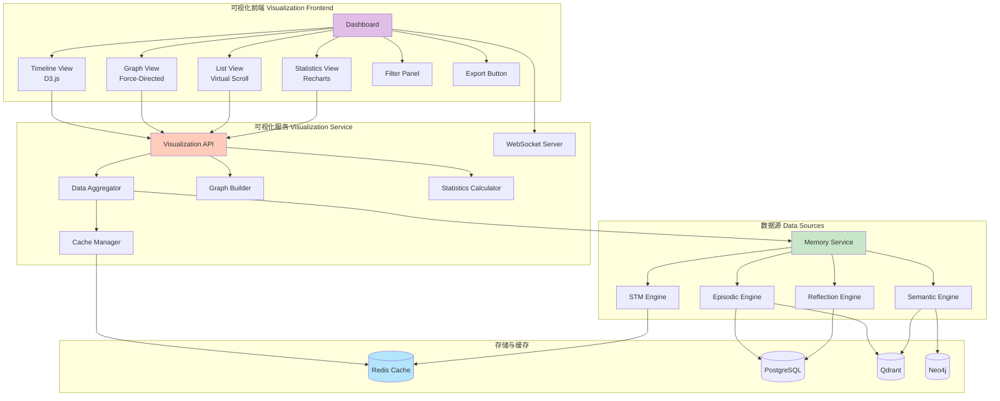

## 完整数据流架构

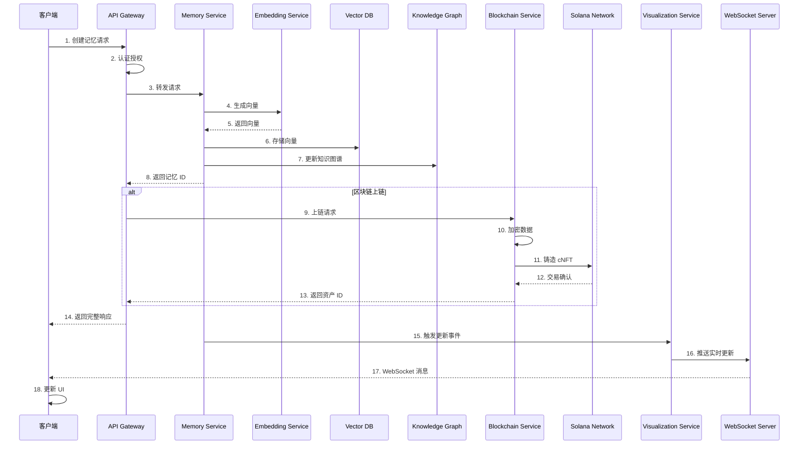

---

## 系统特性总览

### 核心功能模块

#### 1. 记忆管理系统 ✅
- **短期记忆 (STM)**：Redis 缓存，会话级别
- **情景记忆 (Episodic)**：时间戳事件，三要素评分
- **语义记忆 (Semantic)**：知识图谱，结构化知识
- **反思记忆 (Reflection)**：LLM 生成洞察

#### 2. 高级检索系统 ✅
- **向量检索**：Qdrant 语义搜索
- **图谱检索**：Neo4j 关系推理
- **混合检索**：多策略融合
- **标准 RAG**：上下文增强生成
- **智能体 RAG**：多步骤推理

#### 3. 区块链资产化 ✅
- **Solana 智能合约**：Anchor 框架，Rust 实现
- **压缩 NFT**：Metaplex Bubblegum，低成本
- **永久存储**：Arweave/IPFS，去中心化
- **端到端加密**：AES-256-GCM，隐私保护
- **批量优化**：自动批处理，成本节省 30-50%
- **访问控制**：细粒度权限，审计日志
- **TypeScript SDK**：完整客户端库
- **Rust SDK**：高性能原生集成
- **CLI 工具**：命令行管理界面
- **前端界面**：React + Solana Wallet Adapter

#### 4. 可视化系统 ✅
- **时间线视图**：D3.js 时间轴，里程碑标记
- **关系图谱**：力导向图，交互式探索
- **列表视图**：虚拟滚动，高性能渲染
- **统计分析**：Recharts 图表，多维度分析
- **实时更新**：WebSocket 推送，自动刷新
- **数据导出**：JSON/CSV 格式
- **高级过滤**：类型、时间、重要性、搜索
- **Demo 应用**：完整示例，开箱即用

#### 5. 开发工具链 ✅
- **TypeScript SDK**：类型安全，完整 API
- **Rust SDK**：高性能，原生集成
- **CLI 工具**：批量操作，配置管理
- **API 文档**：OpenAPI 规范，Swagger UI
- **示例代码**：Python/JavaScript/Rust 客户端

#### 6. 生产就绪 ✅
- **认证授权**：JWT + RBAC + Solana 签名
- **监控告警**：Prometheus + Grafana + Jaeger
- **容器化**：Docker + Docker Compose
- **数据库迁移**：自动化脚本
- **负载均衡**：RPC 负载均衡器
- **缓存优化**：Redis 多级缓存
- **错误处理**：统一错误处理，重试机制
- **日志审计**：完整操作日志

### 技术亮点

#### 性能优化
- ✅ Redis 缓存（5 分钟 TTL）
- ✅ 批量处理（自动批处理优化）
- ✅ 虚拟滚动（大数据集渲染）
- ✅ Canvas 渲染（1000+ 节点图谱）
- ✅ WebSocket 批处理（100ms 窗口）
- ✅ 数据库索引优化
- ✅ 连接池管理

#### 安全机制
- ✅ JWT 认证
- ✅ RBAC 授权
- ✅ Solana 钱包签名验证
- ✅ AES-256-GCM 加密
- ✅ 密钥派生（基于钱包签名）
- ✅ 限流保护（API + WebSocket）
- ✅ 输入验证
- ✅ 审计日志

#### 可扩展性
- ✅ 微服务架构
- ✅ 水平扩展支持
- ✅ 数据库分片（按 agent_id）
- ✅ 读写分离
- ✅ 负载均衡
- ✅ 容器编排（Kubernetes 就绪）

### 成本分析

#### 区块链成本（Solana + IPFS）
| 操作 | 单条成本 | 批量成本 | 节省 |
|------|---------|---------|------|
| 单条上链 | $0.006 | - | - |
| 10 条批量 | - | $0.005/条 | 17% |
| 50 条批量 | - | $0.004/条 | 33% |
| 100 条批量 | - | $0.003/条 | 50% |

#### 月度成本估算
| 使用量 | 单条上链 | 批量上链 | 年度成本 |
|--------|---------|---------|---------|
| 10 条/月 | $0.06 | $0.05 | $0.60 |
| 100 条/月 | $0.60 | $0.40 | $4.80 |
| 1000 条/月 | $6.00 | $4.00 | $48.00 |
| 10000 条/月 | $60.00 | $40.00 | $480.00 |

### 部署架构

#### 开发环境
- Docker Compose 一键启动
- 本地 Solana 验证器
- 模拟数据生成
- 热重载开发

#### 生产环境
- Kubernetes 集群部署
- 多副本高可用
- 自动扩缩容
- 滚动更新
- 健康检查
- 日志聚合

### 监控指标

#### 核心指标
- 记忆创建/检索 QPS
- 平均响应时间
- 错误率
- 缓存命中率
- 数据库连接池使用率
- 区块链交易成功率
- WebSocket 连接数
- 内存/CPU 使用率

#### 业务指标
- 活跃 Agent 数量
- 记忆总量（按类型）
- 上链记忆数量
- 平均记忆重要性
- 检索频率分布
- 反思生成频率

---

## 总结

MemLayer 是一个**完整的企业级 AI Agent 记忆平台**，提供从记忆管理到可视化、从区块链资产化到智能对话的全栈解决方案。

### 🎯 核心能力
1. **完整记忆系统**：STM、Episodic、Semantic、Reflection 四种记忆类型
2. **高级检索**：向量搜索、知识图谱、混合策略、标准/智能体 RAG
3. **区块链资产化**：Solana + cNFT + Arweave/IPFS，极低成本（$0.003-0.006/记忆）
4. **实时可视化**：时间线、图谱、列表、统计四种视图，WebSocket 实时更新
5. **智能聊天界面**：集成所有功能的统一交互界面，响应式设计
6. **完整工具链**：SDK（TypeScript/Rust）、CLI 工具、5 个前端应用

### 🏗️ 架构特点
- **微服务架构**：12 个服务（7 核心 + 5 区块链），职责清晰，独立扩展
- **多数据库**：PostgreSQL、Qdrant、Neo4j、Redis、TimescaleDB
- **区块链集成**：Solana 智能合约、Metaplex Bubblegum、永久存储
- **实时通信**：2 个 WebSocket 服务器，事件驱动更新
- **前端应用**：5 个完整应用，100+ React 组件

### 🚀 生产就绪
- **安全**：JWT + RBAC + Solana 签名、AES-256-GCM 加密、完整审计日志
- **性能**：Redis 多级缓存、批量优化、虚拟滚动、Canvas 渲染、懒加载
- **监控**：Prometheus + Grafana + Jaeger 完整监控体系
- **部署**：Docker + Kubernetes，GitHub Actions CI/CD
- **文档**：10+ 文档文件，OpenAPI 规范，示例代码

### 💰 成本优化
- **极低成本**：单条 $0.006，批量 $0.003-0.004/记忆
- **完全可选**：不强制上链，用户主动选择
- **批量优化**：自动批处理，节省 30-50% 成本
- **月度成本**：1000 条/月仅需 $4-6

### 📊 技术栈
- **后端**：TypeScript、Node.js 18+、Express.js、Prisma ORM
- **前端**：React 18、Vite、Zustand、React Query、Tailwind CSS
- **可视化**：D3.js、Recharts、Canvas、Force-Directed Graph
- **区块链**：Solana、Anchor、Rust、Metaplex Bubblegum、Arweave/IPFS
- **数据库**：PostgreSQL、Qdrant、Neo4j、Redis、TimescaleDB
- **DevOps**：Docker、Kubernetes、Prometheus、Grafana、Jaeger

### 🎨 前端应用
1. **聊天界面**：智能对话 + 可视化 + 区块链，40+ 组件，完全响应式
2. **记忆可视化**：4 种视图，实时更新，数据导出
3. **区块链前端**：钱包集成，铸造管理，资产操作，20+ 组件
4. **Demo 应用**：2 个完整演示应用，开箱即用

### 📈 项目规模
- **代码文件**：250+ 个 TypeScript/Rust 文件
- **React 组件**：100+ 个组件
- **API 端点**：60+ 个 RESTful API
- **数据库表**：25+ 个表结构
- **文档**：50+ 个 Markdown 文档
- **总代码量**：30,000+ 行代码

### ✨ 技术亮点
- **压缩 NFT**：成本降低 99.5%，Merkle Tree 状态压缩
- **三要素评分**：相关性 + 重要性 + 时效性，智能检索
- **批量优化**：自动批处理，成本节省 30-50%
- **实时可视化**：WebSocket 推送，毫秒级更新
- **响应式设计**：完美适配桌面、平板、移动端
- **暗色模式**：护眼主题，自动切换
- **无障碍访问**：ARIA 标签，屏幕阅读器支持
- **性能优化**：虚拟滚动、懒加载、防抖节流

整个系统采用**现代化微服务架构**，支持**水平扩展**，具备**完善的安全机制**和**监控体系**，提供**优秀的用户体验**，是一个**真正可用于生产环境**的企业级 AI Agent 记忆平台。

---

## 项目统计

### 代码规模
- **总服务数**：12 个（7 核心 + 5 区块链）
- **总代码文件**：250+ 个 TypeScript/Rust 文件
- **智能合约**：1 个 Solana Program（Anchor/Rust）
- **前端应用**：5 个（聊天界面 + 可视化前端 + 区块链前端 + 2 个 Demo）
- **React 组件**：100+ 个组件
- **SDK**：2 个（TypeScript + Rust）
- **CLI 工具**：1 个完整命令行工具（6 个命令）
- **数据库表**：25+ 个表结构
- **API 端点**：60+ 个 RESTful API
- **WebSocket 服务**：2 个实时服务器

### 技术栈统计
- **编程语言**：TypeScript、Rust、Python、SQL
- **后端框架**：Express.js、Anchor Framework
- **前端框架**：React 18、Vite
- **状态管理**：Zustand、React Query
- **数据库**：5 种（PostgreSQL、Qdrant、Neo4j、Redis、TimescaleDB）
- **区块链**：Solana、Metaplex Bubblegum、Arweave/IPFS
- **可视化**：D3.js、Recharts、Canvas
- **样式**：Tailwind CSS
- **DevOps**：Docker、Kubernetes、Prometheus、Grafana、Jaeger

### 功能完成度
- ✅ **核心记忆系统**：100% 完成（4 种记忆类型）
- ✅ **高级检索**：100% 完成（5 种检索策略）
- ✅ **区块链模块**：100% 完成（完整上链流程）
- ✅ **可视化系统**：100% 完成（4 种视图 + 实时更新）
- ✅ **聊天界面**：100% 完成（集成所有功能）
- ✅ **SDK & 工具**：100% 完成（TS/Rust SDK + CLI）
- ✅ **前端界面**：100% 完成（5 个完整应用）
- ✅ **基础设施**：100% 完成（监控、安全、部署）

### 文档完成度
- ✅ 架构文档（本文档 + ARCHITECTURE.md）
- ✅ API 文档（OpenAPI 规范）
- ✅ 用户指南（区块链模块 + 聊天界面）
- ✅ 开发者指南（聊天界面）
- ✅ 部署指南（聊天界面 + Docker）
- ✅ 配置指南（区块链模块）
- ✅ SDK 文档（TypeScript + Rust）
- ✅ CLI 文档（命令参考）
- ✅ FAQ 文档（聊天界面）
- ✅ 快速开始指南
- ✅ 示例代码（Python/JS/Rust）

### 前端应用详情

| 应用 | 端口 | 组件数 | 功能 | 状态 |
|------|------|--------|------|------|
| **聊天界面** | 5173 | 40+ | 智能对话 + 可视化 + 区块链 | ✅ 完成 |
| **记忆可视化** | 3100 | 10+ | 4 种视图 + 实时更新 | ✅ 完成 |
| **区块链前端** | 5174 | 20+ | 钱包 + 铸造 + 资产管理 | ✅ 完成 |
| **可视化 Demo** | 3101 | 5+ | 模拟数据演示 | ✅ 完成 |
| **区块链 Demo** | 5175 | 3+ | 快速演示 | ✅ 完成 |

### 服务端口分配

| 服务 | 端口 | 类型 | 说明 |
|------|------|------|------|
| API Gateway | 3000 | HTTP/WS | 统一入口 |
| Memory Service | 3001 | HTTP | 记忆管理 |
| Embedding Service | 3002 | HTTP | 向量生成 |
| Retrieval Service | 3003 | HTTP | 检索服务 |
| Reflection Service | 3004 | HTTP | 反思机制 |
| Management Service | 3005 | HTTP | 生命周期管理 |
| Visualization Service | 3006 | HTTP/WS | 可视化服务 |
| PostgreSQL | 5432 | DB | 关系数据库 |
| Qdrant | 6333 | DB | 向量数据库 |
| Neo4j | 7474/7687 | DB | 知识图谱 |
| Redis | 6379 | Cache | 缓存/STM |
| Prometheus | 9090 | Monitor | 指标收集 |
| Grafana | 3001 | Monitor | 可视化监控 |
| Jaeger | 16686 | Trace | 链路追踪 |

---

## 快速链接

### 核心文档
- [项目 README](../README.md) - 项目概述和快速开始
- [架构文档](../docs/ARCHITECTURE.md) - 详细架构说明
- [API 文档](../docs/API_GUIDE.md) - API 使用指南
- [部署文档](../docs/DEPLOYMENT.md) - 部署指南

### 区块链模块
- [区块链 README](../blockchain/README.md) - 区块链模块概述
- [用户指南](../blockchain/USER_GUIDE.md) - 使用指南
- [配置指南](../blockchain/CONFIGURATION_GUIDE.md) - 配置说明
- [SDK 文档](../blockchain/sdk/SDK_GUIDE.md) - SDK 使用
- [CLI 文档](../blockchain/cli/README.md) - CLI 工具

### 可视化模块
- [可视化服务](../services/visualization-service/README.md) - 服务文档
- [可视化前端](../frontend/memory-visualization/README.md) - 前端文档
- [Demo 应用](../frontend/memory-visualization-demo/README.md) - Demo 说明
- [实现总结](../MEMORY_VISUALIZATION_IMPLEMENTATION.md) - 实现细节

### 开发指南
- [贡献指南](../CONTRIBUTING.md) - 如何贡献
- [Solana 设置](../docs/SOLANA_SETUP.md) - Solana 环境配置
- [启动指南](../START_GUIDE.md) - 快速启动
- [示例代码](../examples/) - 客户端示例

---

## 更新日志

### v1.0.0 (2024-11)
- ✅ 完成核心记忆系统（STM、Episodic、Semantic、Reflection）
- ✅ 完成高级检索系统（Vector、Graph、Hybrid、RAG）
- ✅ 完成区块链模块（Solana + cNFT + Arweave）
- ✅ 完成可视化系统（4 种视图 + 实时更新）
- ✅ 完成 SDK 和工具链（TypeScript/Rust SDK + CLI）
- ✅ 完成前端界面（3 个完整应用）
- ✅ 完成基础设施（监控、安全、部署）
- ✅ 完成文档体系（架构、API、用户指南）

---

## 联系方式

- **GitHub Issues**：报告问题和功能请求
- **文档**：查看完整文档
- **示例**：参考示例代码

---

**MemLayer** - 企业级 AI Agent 记忆平台 🚀
