# MemLayer 项目架构图

## 系统概览

MemLayer 是一个**企业级 AI Agent 记忆平台**，提供完整的记忆管理、高级检索、区块链资产化和实时可视化能力。

### 核心模块
- 🧠 **记忆管理系统**：STM、Episodic、Semantic、Reflection 四种记忆类型
- 🔍 **高级检索系统**：向量搜索、知识图谱、混合策略、RAG 工作流
- ⛓️ **区块链资产化**：Solana + cNFT + Arweave，极低成本上链
- 📊 **实时可视化**：时间线、图谱、列表、统计四种视图
- 🛠️ **完整工具链**：SDK（TypeScript/Rust）、CLI、前端界面

### 技术架构
- **微服务架构**：8 个核心服务 + 5 个区块链服务
- **多数据库**：PostgreSQL、Qdrant、Neo4j、Redis、TimescaleDB
- **区块链**：Solana 智能合约、Metaplex Bubblegum、Arweave 存储
- **实时通信**：WebSocket 服务器、事件驱动更新

---

## 整体系统架构

```mermaid
graph TB
    subgraph "客户端层 Client Layer"
        A1[AI Agent 应用]
        A2[Web 应用]
        A3[第三方服务]
        A4[CLI 工具]
        A5[区块链前端]
        A6[可视化前端]
    end

    subgraph "API 网关层 API Gateway"
        B1[API Gateway]
        B2[认证 JWT]
        B3[授权 RBAC]
        B4[限流]
        B5[路由]
        B6[Solana 认证]
    end

    subgraph "核心服务层 Core Services"
        C1[Memory Service<br/>记忆管理]
        C2[Embedding Service<br/>向量生成]
        C3[Retrieval Service<br/>检索服务]
        C4[Reflection Service<br/>反思机制]
        C5[Management Service<br/>生命周期管理]
        C6[Visualization Service<br/>可视化服务]
    end

    subgraph "区块链服务层 Blockchain Services"
        D1[Minting Service<br/>铸造服务]
        D2[Encryption Service<br/>加密服务]
        D3[Indexer Service<br/>索引服务]
        D4[Access Control<br/>访问控制]
        D5[Arweave Service<br/>存储服务]
    end

    subgraph "记忆引擎层 Memory Engines"
        E1[STM Engine<br/>短期记忆]
        E2[Episodic Memory<br/>情景记忆]
        E3[Semantic Memory<br/>语义记忆]
        E4[RAG Engine<br/>检索增强]
    end

    subgraph "区块链层 Blockchain Layer"
        F1[Solana Program<br/>智能合约]
        F2[Metaplex Bubblegum<br/>压缩 NFT]
        F3[Arweave<br/>永久存储]
        F4[RPC Load Balancer<br/>负载均衡]
    end

    subgraph "存储层 Storage Layer"
        G1[(PostgreSQL<br/>关系数据库)]
        G2[(Qdrant<br/>向量数据库)]
        G3[(Neo4j<br/>知识图谱)]
        G4[(Redis<br/>缓存)]
        G5[(TimescaleDB<br/>时序数据)]
        G6[(Blockchain DB<br/>区块链数据)]
    end

    subgraph "外部服务 External Services"
        H1[OpenAI API<br/>嵌入/LLM]
        H2[Solana RPC<br/>区块链节点]
        H3[Arweave Gateway<br/>存储网关]
    end

    subgraph "监控层 Monitoring"
        I1[Prometheus<br/>指标收集]
        I2[Grafana<br/>可视化]
        I3[Jaeger<br/>链路追踪]
    end

    A1 & A2 & A3 & A4 & A5 & A6 --> B1
    B1 --> B2 & B3 & B4 & B5 & B6
    B5 --> C1 & C2 & C3 & C4 & C5 & C6
    B5 --> D1 & D2 & D3 & D4 & D5
    
    C1 --> E1 & E2 & E3
    C3 --> E4
    C6 --> C1
    
    D1 --> D2 & D5
    D1 --> F1 & F4
    D3 --> F1 & F4
    D4 --> F1
    
    E1 --> G4
    E2 --> G1 & G2
    E3 --> G2 & G3
    E4 --> G2 & G3
    C6 --> G4
    D3 --> G6
    
    F1 --> F2
    D5 --> F3
    F4 --> H2
    
    C2 --> H1
    C4 --> H1
    D5 --> H3
    
    C1 & C2 & C3 & C4 & C5 & C6 --> I1
    D1 & D2 & D3 & D4 & D5 --> I1
    I1 --> I2
    I1 --> I3

    style A1 fill:#e1f5ff
    style A2 fill:#e1f5ff
    style A3 fill:#e1f5ff
    style A4 fill:#e1f5ff
    style A5 fill:#e1f5ff
    style A6 fill:#e1f5ff
    style B1 fill:#fff4e6
    style C1 fill:#e8f5e9
    style C2 fill:#e8f5e9
    style C3 fill:#e8f5e9
    style C4 fill:#e8f5e9
    style C5 fill:#e8f5e9
    style C6 fill:#e8f5e9
    style D1 fill:#f3e5f5
    style D2 fill:#f3e5f5
    style D3 fill:#f3e5f5
    style D4 fill:#f3e5f5
    style D5 fill:#f3e5f5
    style F1 fill:#ffe0b2
    style F2 fill:#ffe0b2
    style F3 fill:#ffe0b2
    style F4 fill:#ffe0b2
```

## 核心服务详细架构

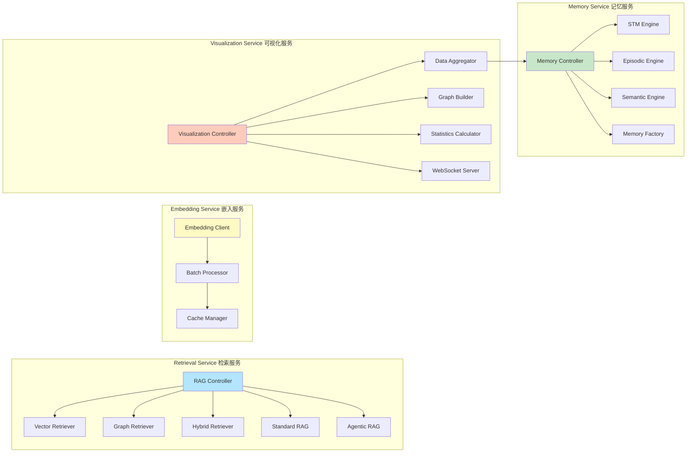

## 区块链模块架构

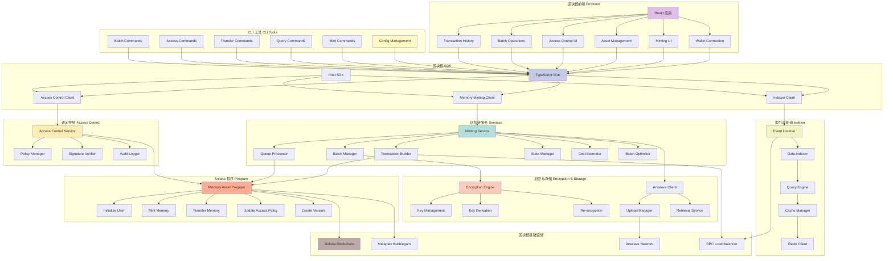

## 数据流架构

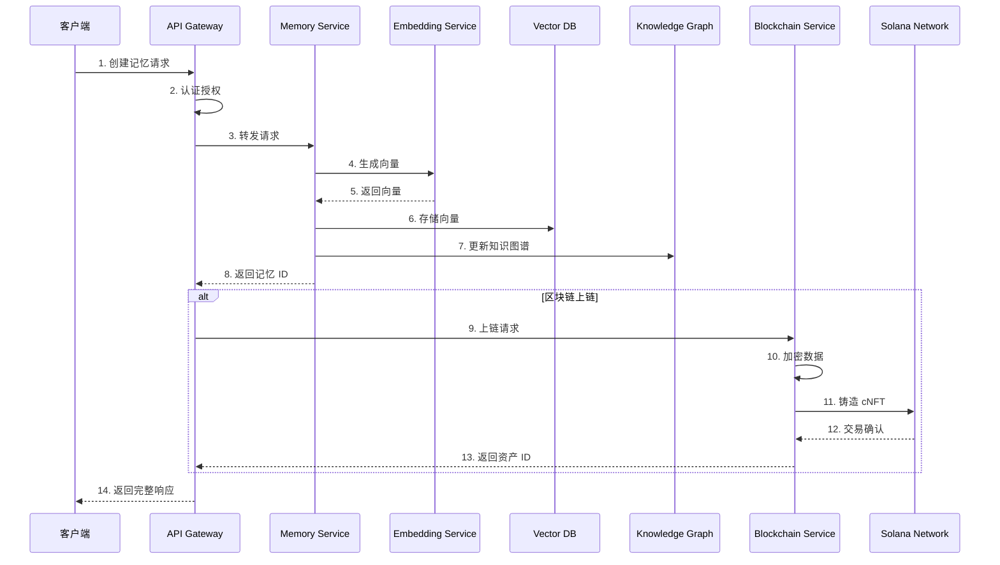

## 记忆检索流程

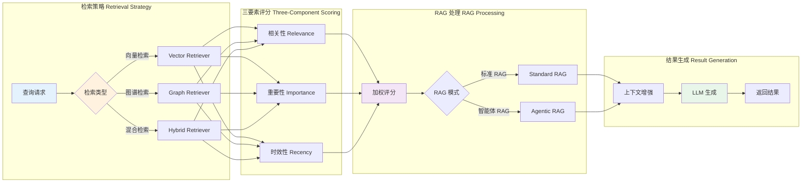

## 区块链铸造流程

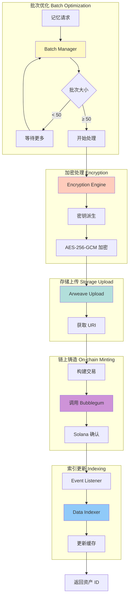

## 技术栈总览

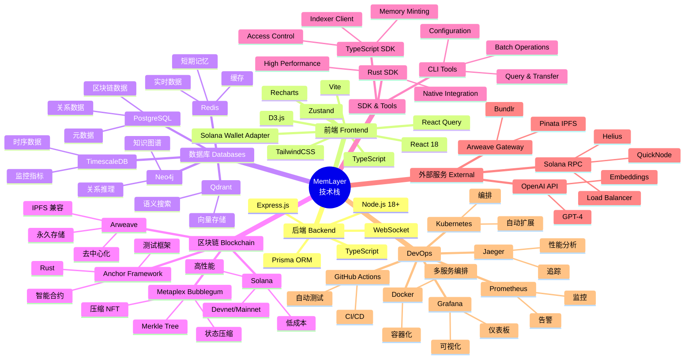

## 部署架构

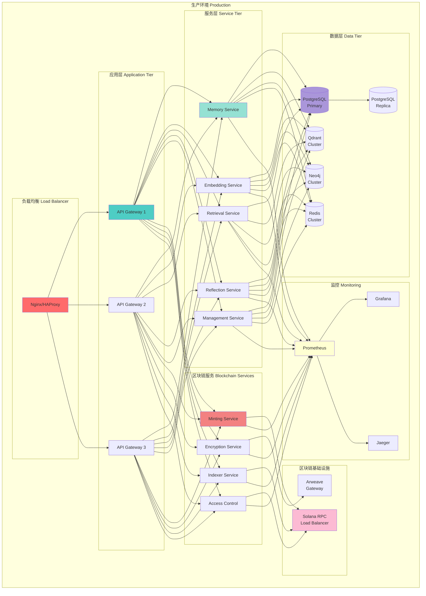

## 安全架构

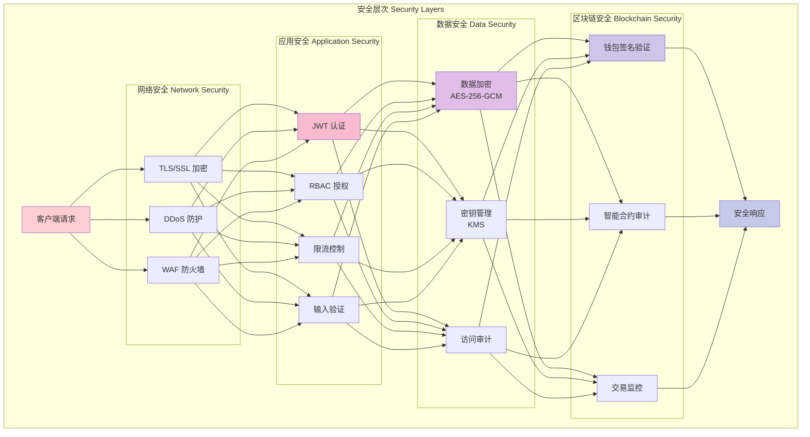

## 项目目录结构

```mermaid
graph TB
    ROOT[agent-memory-platform/]
    
    ROOT --> PKG[packages/]
    ROOT --> SVC[services/]
    ROOT --> BC[blockchain/]
    ROOT --> FE[frontend/]
    ROOT --> SCRIPT[scripts/]
    ROOT --> DOC[docs/]
    ROOT --> CONFIG[config/]
    ROOT --> EXAMPLES[examples/]
    
    PKG --> PKG1[shared/]
    PKG --> PKG2[database/]
    PKG --> PKG3[vector-db/]
    PKG --> PKG4[knowledge-graph/]
    PKG --> PKG5[cache/]
    
    SVC --> SVC1[api-gateway/]
    SVC --> SVC2[memory-service/]
    SVC --> SVC3[embedding-service/]
    SVC --> SVC4[retrieval-service/]
    SVC --> SVC5[reflection-service/]
    SVC --> SVC6[management-service/]
    SVC --> SVC7[visualization-service/]
    
    BC --> BC1[programs/]
    BC --> BC2[services/]
    BC --> BC3[sdk/]
    BC --> BC4[frontend/]
    BC --> BC5[cli/]
    BC --> BC6[database/]
    BC --> BC7[config/]
    BC --> BC8[core/]
    BC --> BC9[frontend-demo/]
    
    BC1 --> BC1A[memory-asset/]
    BC2 --> BC2A[minting-service/]
    BC2 --> BC2B[encryption/]
    BC2 --> BC2C[indexer/]
    BC2 --> BC2D[access-control/]
    BC2 --> BC2E[arweave/]
    BC2 --> BC2F[shared/]
    BC3 --> BC3A[typescript/]
    BC3 --> BC3B[rust/]
    BC4 --> BC4A[components/]
    BC4 --> BC4B[hooks/]
    BC4 --> BC4C[contexts/]
    BC5 --> BC5A[commands/]
    BC5 --> BC5B[utils/]
    
    FE --> FE1[memory-visualization/]
    FE --> FE2[memory-visualization-demo/]
    
    FE1 --> FE1A[components/]
    FE1 --> FE1B[api/]
    FE1 --> FE1C[hooks/]
    FE1 --> FE1D[store/]
    
    FE2 --> FE2A[components/]
    FE2 --> FE2B[data/]

    style ROOT fill:#e3f2fd
    style PKG fill:#fff3e0
    style SVC fill:#e8f5e9
    style BC fill:#f3e5f5
    style FE fill:#e1bee7
    style BC1 fill:#ffebee
    style BC2 fill:#fce4ec
    style BC3 fill:#f3e5f5
    style BC4 fill:#e1bee7
    style BC5 fill:#fff9c4
```

## 功能模块对比表

| 功能模块 | 核心服务 | 区块链模块 | 可视化模块 | 状态 |
|---------|---------|-----------|-----------|------|
| **记忆管理** | | | | |
| 短期记忆 (STM) | ✅ Memory Service | - | ✅ 可视化 | 完成 |
| 情景记忆 (Episodic) | ✅ Memory Service | ✅ 可上链 | ✅ 可视化 | 完成 |
| 语义记忆 (Semantic) | ✅ Memory Service | ✅ 可上链 | ✅ 可视化 | 完成 |
| 反思记忆 (Reflection) | ✅ Reflection Service | ✅ 可上链 | ✅ 可视化 | 完成 |
| **检索系统** | | | | |
| 向量检索 | ✅ Retrieval Service | - | - | 完成 |
| 图谱检索 | ✅ Retrieval Service | - | ✅ 关系图谱 | 完成 |
| 混合检索 | ✅ Retrieval Service | - | - | 完成 |
| 标准 RAG | ✅ Retrieval Service | - | - | 完成 |
| 智能体 RAG | ✅ Retrieval Service | - | - | 完成 |
| **区块链** | | | | |
| 记忆铸造 | - | ✅ Minting Service | - | 完成 |
| 批量优化 | - | ✅ Batch Manager | - | 完成 |
| 加密存储 | - | ✅ Encryption Service | - | 完成 |
| 永久存储 | - | ✅ Arweave Service | - | 完成 |
| 访问控制 | - | ✅ Access Control | - | 完成 |
| 链上索引 | - | ✅ Indexer Service | - | 完成 |
| **SDK & 工具** | | | | |
| TypeScript SDK | ✅ API Client | ✅ 完整支持 | ✅ API Client | 完成 |
| Rust SDK | - | ✅ 完整支持 | - | 完成 |
| CLI 工具 | - | ✅ 完整支持 | - | 完成 |
| Python 客户端 | ✅ 示例 | - | - | 完成 |
| **可视化** | | | | |
| 时间线视图 | - | - | ✅ D3.js | 完成 |
| 关系图谱 | - | - | ✅ Force-Directed | 完成 |
| 列表视图 | - | - | ✅ Virtual Scroll | 完成 |
| 统计分析 | - | - | ✅ Recharts | 完成 |
| 实时更新 | - | - | ✅ WebSocket | 完成 |
| 数据导出 | - | - | ✅ JSON/CSV | 完成 |
| **前端界面** | | | | |
| 区块链前端 | - | ✅ React + Wallet | - | 完成 |
| 可视化前端 | - | - | ✅ React + D3 | 完成 |
| Demo 应用 | - | ✅ 完整示例 | ✅ 完整示例 | 完成 |
| **基础设施** | | | | |
| 认证授权 | ✅ JWT + RBAC | ✅ Solana 签名 | ✅ JWT | 完成 |
| 监控告警 | ✅ Prometheus | ✅ Prometheus | ✅ Prometheus | 完成 |
| 缓存优化 | ✅ Redis | ✅ Redis | ✅ Redis | 完成 |
| 容器化 | ✅ Docker | ✅ Docker | ✅ Docker | 完成 |

## 可视化系统架构

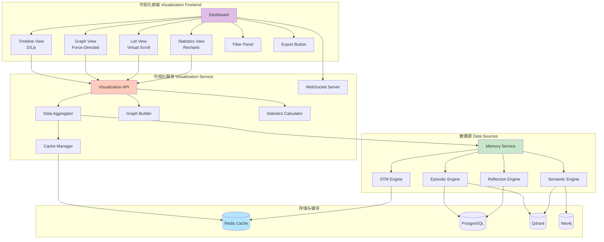

## 完整数据流架构

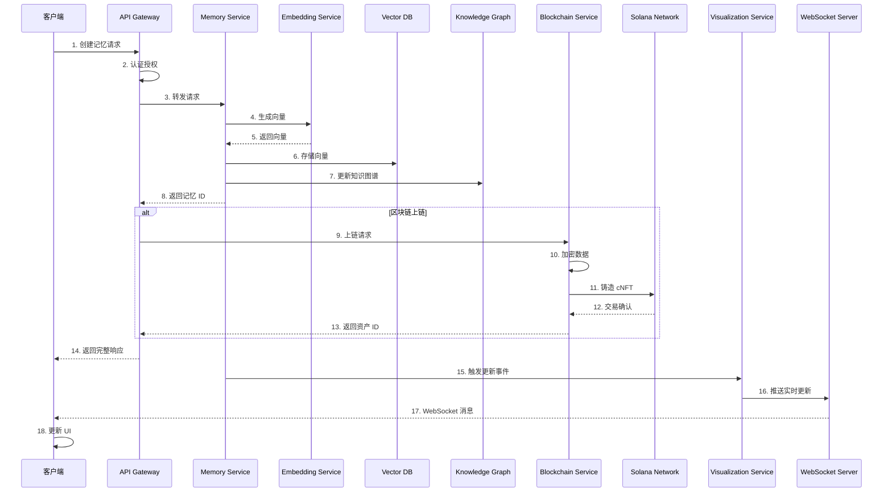

---

## 系统特性总览

### 核心功能模块

#### 1. 记忆管理系统 ✅
- **短期记忆 (STM)**：Redis 缓存，会话级别
- **情景记忆 (Episodic)**：时间戳事件，三要素评分
- **语义记忆 (Semantic)**：知识图谱，结构化知识
- **反思记忆 (Reflection)**：LLM 生成洞察

#### 2. 高级检索系统 ✅
- **向量检索**：Qdrant 语义搜索
- **图谱检索**：Neo4j 关系推理
- **混合检索**：多策略融合
- **标准 RAG**：上下文增强生成
- **智能体 RAG**：多步骤推理

#### 3. 区块链资产化 ✅
- **Solana 智能合约**：Anchor 框架，Rust 实现
- **压缩 NFT**：Metaplex Bubblegum，低成本
- **永久存储**：Arweave/IPFS，去中心化
- **端到端加密**：AES-256-GCM，隐私保护
- **批量优化**：自动批处理，成本节省 30-50%
- **访问控制**：细粒度权限，审计日志
- **TypeScript SDK**：完整客户端库
- **Rust SDK**：高性能原生集成
- **CLI 工具**：命令行管理界面
- **前端界面**：React + Solana Wallet Adapter

#### 4. 可视化系统 ✅
- **时间线视图**：D3.js 时间轴，里程碑标记
- **关系图谱**：力导向图，交互式探索
- **列表视图**：虚拟滚动，高性能渲染
- **统计分析**：Recharts 图表，多维度分析
- **实时更新**：WebSocket 推送，自动刷新
- **数据导出**：JSON/CSV 格式
- **高级过滤**：类型、时间、重要性、搜索
- **Demo 应用**：完整示例，开箱即用

#### 5. 开发工具链 ✅
- **TypeScript SDK**：类型安全，完整 API
- **Rust SDK**：高性能，原生集成
- **CLI 工具**：批量操作，配置管理
- **API 文档**：OpenAPI 规范，Swagger UI
- **示例代码**：Python/JavaScript/Rust 客户端

#### 6. 生产就绪 ✅
- **认证授权**：JWT + RBAC + Solana 签名
- **监控告警**：Prometheus + Grafana + Jaeger
- **容器化**：Docker + Docker Compose
- **数据库迁移**：自动化脚本
- **负载均衡**：RPC 负载均衡器
- **缓存优化**：Redis 多级缓存
- **错误处理**：统一错误处理，重试机制
- **日志审计**：完整操作日志

### 技术亮点

#### 性能优化
- ✅ Redis 缓存（5 分钟 TTL）
- ✅ 批量处理（自动批处理优化）
- ✅ 虚拟滚动（大数据集渲染）
- ✅ Canvas 渲染（1000+ 节点图谱）
- ✅ WebSocket 批处理（100ms 窗口）
- ✅ 数据库索引优化
- ✅ 连接池管理

#### 安全机制
- ✅ JWT 认证
- ✅ RBAC 授权
- ✅ Solana 钱包签名验证
- ✅ AES-256-GCM 加密
- ✅ 密钥派生（基于钱包签名）
- ✅ 限流保护（API + WebSocket）
- ✅ 输入验证
- ✅ 审计日志

#### 可扩展性
- ✅ 微服务架构
- ✅ 水平扩展支持
- ✅ 数据库分片（按 agent_id）
- ✅ 读写分离
- ✅ 负载均衡
- ✅ 容器编排（Kubernetes 就绪）

### 成本分析

#### 区块链成本（Solana + IPFS）
| 操作 | 单条成本 | 批量成本 | 节省 |
|------|---------|---------|------|
| 单条上链 | $0.006 | - | - |
| 10 条批量 | - | $0.005/条 | 17% |
| 50 条批量 | - | $0.004/条 | 33% |
| 100 条批量 | - | $0.003/条 | 50% |

#### 月度成本估算
| 使用量 | 单条上链 | 批量上链 | 年度成本 |
|--------|---------|---------|---------|
| 10 条/月 | $0.06 | $0.05 | $0.60 |
| 100 条/月 | $0.60 | $0.40 | $4.80 |
| 1000 条/月 | $6.00 | $4.00 | $48.00 |
| 10000 条/月 | $60.00 | $40.00 | $480.00 |

### 部署架构

#### 开发环境
- Docker Compose 一键启动
- 本地 Solana 验证器
- 模拟数据生成
- 热重载开发

#### 生产环境
- Kubernetes 集群部署
- 多副本高可用
- 自动扩缩容
- 滚动更新
- 健康检查
- 日志聚合

### 监控指标

#### 核心指标
- 记忆创建/检索 QPS
- 平均响应时间
- 错误率
- 缓存命中率
- 数据库连接池使用率
- 区块链交易成功率
- WebSocket 连接数
- 内存/CPU 使用率

#### 业务指标
- 活跃 Agent 数量
- 记忆总量（按类型）
- 上链记忆数量
- 平均记忆重要性
- 检索频率分布
- 反思生成频率

---

## 总结

MemLayer 是一个**完整的企业级 AI Agent 记忆平台**，包含：

### 🎯 核心能力
1. **完整记忆系统**：STM、Episodic、Semantic、Reflection 四种记忆类型
2. **高级检索**：向量搜索、知识图谱、混合策略、RAG 工作流
3. **区块链资产化**：Solana + cNFT + Arweave，极低成本，完全可选
4. **实时可视化**：四种视图，WebSocket 实时更新，交互式探索
5. **完整工具链**：SDK（TS/Rust）、CLI、前端界面、API 文档

### 🏗️ 架构特点
- **微服务架构**：8 个核心服务，职责清晰，独立扩展
- **多数据库**：PostgreSQL、Qdrant、Neo4j、Redis、TimescaleDB
- **区块链集成**：Solana 智能合约、压缩 NFT、永久存储
- **实时通信**：WebSocket 服务器，事件驱动更新

### 🚀 生产就绪
- **安全**：多层认证授权、端到端加密、审计日志
- **性能**：多级缓存、批量优化、虚拟滚动、Canvas 渲染
- **监控**：Prometheus + Grafana + Jaeger 完整监控体系
- **部署**：Docker + Kubernetes，自动化 CI/CD

### 💰 成本优化
- **极低成本**：$0.003-0.006/记忆（批量优化）
- **完全可选**：不强制上链，用户自主选择
- **批量优化**：自动批处理，节省 30-50% 成本

### 📊 技术栈
- **后端**：TypeScript、Node.js、Express、Prisma
- **前端**：React 18、Vite、D3.js、Recharts、Tailwind CSS
- **区块链**：Solana、Anchor、Rust、Metaplex Bubblegum
- **数据库**：PostgreSQL、Qdrant、Neo4j、Redis
- **DevOps**：Docker、Kubernetes、Prometheus、Grafana

整个系统采用**现代化微服务架构**，支持**水平扩展**，具备**完善的安全机制**和**监控体系**，是一个**真正可用于生产环境**的 AI Agent 记忆平台。

---

## 项目统计

### 代码规模
- **总服务数**：13 个（8 核心 + 5 区块链）
- **总代码文件**：200+ 个 TypeScript/Rust 文件
- **智能合约**：1 个 Solana Program（Anchor/Rust）
- **前端应用**：3 个（区块链前端 + 可视化前端 + Demo）
- **SDK**：2 个（TypeScript + Rust）
- **CLI 工具**：1 个完整命令行工具
- **数据库表**：20+ 个表结构
- **API 端点**：50+ 个 RESTful API
- **WebSocket 服务**：2 个实时服务器

### 技术栈统计
- **编程语言**：TypeScript、Rust、Python
- **框架**：Express.js、React 18、Anchor、Vite
- **数据库**：5 种（PostgreSQL、Qdrant、Neo4j、Redis、TimescaleDB）
- **区块链**：Solana、Metaplex Bubblegum、Arweave
- **可视化**：D3.js、Recharts、Canvas
- **DevOps**：Docker、Kubernetes、Prometheus、Grafana、Jaeger

### 功能完成度
- ✅ **核心记忆系统**：100% 完成（4 种记忆类型）
- ✅ **高级检索**：100% 完成（5 种检索策略）
- ✅ **区块链模块**：100% 完成（完整上链流程）
- ✅ **可视化系统**：100% 完成（4 种视图 + 实时更新）
- ✅ **SDK & 工具**：100% 完成（TS/Rust SDK + CLI）
- ✅ **前端界面**：100% 完成（3 个完整应用）
- ✅ **基础设施**：100% 完成（监控、安全、部署）

### 文档完成度
- ✅ 架构文档（本文档）
- ✅ API 文档（OpenAPI 规范）
- ✅ 用户指南（区块链模块）
- ✅ 配置指南（区块链模块）
- ✅ SDK 文档（TypeScript + Rust）
- ✅ CLI 文档（命令参考）
- ✅ 部署指南（Docker + K8s）
- ✅ 快速开始指南
- ✅ 示例代码（Python/JS/Rust）

---

## 快速链接

### 核心文档
- [项目 README](../README.md) - 项目概述和快速开始
- [架构文档](../docs/ARCHITECTURE.md) - 详细架构说明
- [API 文档](../docs/API_GUIDE.md) - API 使用指南
- [部署文档](../docs/DEPLOYMENT.md) - 部署指南

### 区块链模块
- [区块链 README](../blockchain/README.md) - 区块链模块概述
- [用户指南](../blockchain/USER_GUIDE.md) - 使用指南
- [配置指南](../blockchain/CONFIGURATION_GUIDE.md) - 配置说明
- [SDK 文档](../blockchain/sdk/SDK_GUIDE.md) - SDK 使用
- [CLI 文档](../blockchain/cli/README.md) - CLI 工具

### 可视化模块
- [可视化服务](../services/visualization-service/README.md) - 服务文档
- [可视化前端](../frontend/memory-visualization/README.md) - 前端文档
- [Demo 应用](../frontend/memory-visualization-demo/README.md) - Demo 说明
- [实现总结](../MEMORY_VISUALIZATION_IMPLEMENTATION.md) - 实现细节

### 开发指南
- [贡献指南](../CONTRIBUTING.md) - 如何贡献
- [Solana 设置](../docs/SOLANA_SETUP.md) - Solana 环境配置
- [启动指南](../START_GUIDE.md) - 快速启动
- [示例代码](../examples/) - 客户端示例

---

## 更新日志

### v1.0.0 (2024-11)
- ✅ 完成核心记忆系统（STM、Episodic、Semantic、Reflection）
- ✅ 完成高级检索系统（Vector、Graph、Hybrid、RAG）
- ✅ 完成区块链模块（Solana + cNFT + Arweave）
- ✅ 完成可视化系统（4 种视图 + 实时更新）
- ✅ 完成 SDK 和工具链（TypeScript/Rust SDK + CLI）
- ✅ 完成前端界面（3 个完整应用）
- ✅ 完成基础设施（监控、安全、部署）
- ✅ 完成文档体系（架构、API、用户指南）

---

## 联系方式

- **GitHub Issues**：报告问题和功能请求
- **文档**：查看完整文档
- **示例**：参考示例代码

---

**MemLayer** - 企业级 AI Agent 记忆平台 🚀
