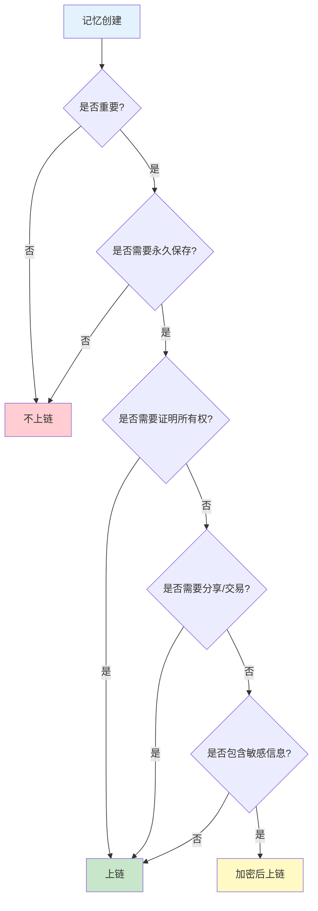

# 记忆上链决策指南

## 概述

并非所有记忆都需要上链。上链意味着**永久存储**、**不可篡改**、**真正所有权**，但也意味着**成本**和**不可删除**。

本指南帮助你决定哪些记忆应该上链。

## 快速决策树



## 应该上链的记忆类型

### 1. 高价值记忆 (High-Value Memories)

**特征**：
- 重要性分数 ≥ 0.8
- 包含关键决策
- 具有长期参考价值
- 可能产生经济价值

**示例**：
```typescript
{
  type: "episodic",
  content: "与客户签订了为期三年的合作协议，年价值 $500K",
  importance: 0.95,
  tags: ["business", "contract", "milestone"],
  context: {
    participants: ["user", "client_ceo"],
    location: "headquarters",
    outcome: "success"
  }
}
```

**为什么上链**：
- ✅ 证明交易发生的时间和内容
- ✅ 不可篡改的商业记录
- ✅ 可作为法律证据
- ✅ 可以安全分享给相关方

**推荐配置**：
```typescript
{
  chain: 'solana',
  encrypt: true,
  automatic: false,  // 需要用户确认
  minImportance: 0.8
}
```

---

### 2. 里程碑记忆 (Milestone Memories)

**特征**：
- 标记重要的人生/项目节点
- 具有纪念意义
- 可能需要回顾
- 用户明确标记为"重要"

**示例**：
```typescript
{
  type: "episodic",
  content: "完成了第一个 AI 项目的部署，用户量突破 10 万",
  importance: 0.9,
  tags: ["milestone", "achievement", "project"],
  metadata: {
    projectName: "AI Assistant v1.0",
    date: "2024-01-15",
    metrics: {
      users: 100000,
      satisfaction: 4.8
    }
  }
}
```

**为什么上链**：
- ✅ 永久记录成就
- ✅ 可以作为个人/团队历史
- ✅ 可以分享给团队成员
- ✅ 可以作为简历/作品集的一部分

**推荐配置**：
```typescript
{
  chain: 'solana',
  encrypt: false,  // 可以公开
  automatic: true,
  minImportance: 0.85
}
```

---

### 3. 学习与洞察 (Learning & Insights)

**特征**：
- 反思生成的洞察
- 从多个记忆中提炼的模式
- 具有指导意义的经验
- 可复用的知识

**示例**：
```typescript
{
  type: "reflection",
  content: "分析了过去 50 次客户沟通，发现在下午 2-4 点沟通效果最好，客户更愿意做决策",
  importance: 0.88,
  insightScore: 0.92,
  sourceMemories: ["mem-001", "mem-002", "..."],
  tags: ["insight", "pattern", "sales"],
  reasoning: [
    "统计了 50 次沟通的时间和结果",
    "发现下午时段成功率高 40%",
    "客户反馈显示下午精力更充沛"
  ]
}
```

**为什么上链**：
- ✅ 保存宝贵的经验总结
- ✅ 可以分享给团队
- ✅ 可以作为培训材料
- ✅ 具有长期参考价值

**推荐配置**：
```typescript
{
  chain: 'solana',
  encrypt: false,
  automatic: true,
  minInsightScore: 0.85
}
```

---

### 4. 创意与灵感 (Creative Ideas)

**特征**：
- 原创想法
- 创新方案
- 可能产生知识产权
- 需要证明创作时间

**示例**：
```typescript
{
  type: "semantic",
  content: "设计了一个新的 AI 记忆压缩算法，可以将存储成本降低 80%",
  importance: 0.92,
  tags: ["idea", "innovation", "algorithm"],
  metadata: {
    category: "technical",
    status: "concept",
    potentialImpact: "high"
  }
}
```

**为什么上链**：
- ✅ 证明创意的原创性和时间
- ✅ 保护知识产权
- ✅ 可以作为专利申请的证据
- ✅ 可以安全分享给投资人/合作伙伴

**推荐配置**：
```typescript
{
  chain: 'ethereum',  // 高价值用 Ethereum
  encrypt: true,
  automatic: false,
  minImportance: 0.9
}
```

---

### 5. 重要对话 (Important Conversations)

**特征**：
- 关键决策讨论
- 协议达成
- 重要承诺
- 需要存档的沟通

**示例**：
```typescript
{
  type: "conversation",
  participants: ["user", "partner"],
  turns: 25,
  duration: 1800,  // 30 分钟
  summary: "讨论并确定了产品路线图，双方同意在 Q2 推出新功能",
  importance: 0.87,
  tags: ["planning", "agreement", "roadmap"],
  keyPoints: [
    "Q2 推出 AI 助手功能",
    "预算 $200K",
    "目标用户增长 50%"
  ]
}
```

**为什么上链**：
- ✅ 不可篡改的沟通记录
- ✅ 可以作为协议证明
- ✅ 双方都可以访问
- ✅ 避免"他说她说"的争议

**推荐配置**：
```typescript
{
  chain: 'polygon',
  encrypt: true,
  automatic: false,
  minTurns: 10,
  minDuration: 600  // 10 分钟
}
```

---

### 6. 知识图谱 (Knowledge Graphs)

**特征**：
- 完整的知识体系
- 多个概念的关联
- 领域专业知识
- 可以作为资产交易

**示例**：
```typescript
{
  type: "knowledge",
  name: "AI 产品开发知识图谱",
  nodes: 150,
  edges: 300,
  topics: ["AI", "product", "development", "deployment"],
  importance: 0.95,
  metadata: {
    domain: "AI Product Management",
    completeness: 0.85,
    validated: true
  }
}
```

**为什么上链**：
- ✅ 证明知识体系的完整性
- ✅ 可以作为数字资产交易
- ✅ 可以授权他人使用
- ✅ 保护知识产权

**推荐配置**：
```typescript
{
  chain: 'ethereum',  // 高价值
  encrypt: true,
  automatic: false,
  minNodes: 50,
  requireValidation: true
}
```

---

## 不应该上链的记忆类型

### ❌ 1. 临时记忆

**特征**：
- 短期有效
- 会话级别
- 无长期价值

**示例**：
- "用户刚才问了天气"
- "临时保存的草稿"
- "当前对话上下文"

**原因**：
- 上链成本不值得
- 会产生大量无用数据
- 可能很快过时

---

### ❌ 2. 低重要性记忆

**特征**：
- 重要性分数 < 0.5
- 日常琐事
- 可替代的信息

**示例**：
- "用户说了'你好'"
- "查询了某个简单问题"
- "日常闲聊"

**原因**：
- 不值得永久保存
- 占用存储空间
- 增加检索噪音

---

### ❌ 3. 敏感隐私信息（未加密）

**特征**：
- 个人身份信息
- 财务信息
- 健康信息
- 密码/密钥

**示例**：
- "用户的信用卡号是..."
- "用户的家庭住址是..."
- "用户的医疗记录..."

**原因**：
- 即使加密也有风险
- 可能违反隐私法规（GDPR、CCPA）
- 一旦上链无法删除

**替代方案**：
- 使用传统数据库存储
- 实施严格的访问控制
- 支持数据删除

---

### ❌ 4. 频繁变化的数据

**特征**：
- 需要经常更新
- 实时数据
- 动态内容

**示例**：
- "当前股票价格"
- "实时位置信息"
- "在线状态"

**原因**：
- 区块链不适合频繁更新
- 成本过高
- 数据会快速过时

---

### ❌ 5. 大型文件

**特征**：
- 视频、音频
- 大型图片
- 完整文档

**示例**：
- "会议录音（100MB）"
- "演示视频（500MB）"
- "完整的 PDF 文档"

**原因**：
- 存储成本极高
- 上传时间长
- 检索效率低

**替代方案**：
- 存储到 IPFS/Arweave
- 只在链上存储哈希和元数据
- 使用传统云存储

---

## 上链决策评分系统

### 评分标准

```typescript
interface MintingScore {
  importance: number;      // 0-1，重要性
  longevity: number;       // 0-1，长期价值
  ownership: number;       // 0-1，所有权需求
  shareability: number;    // 0-1，分享需求
  immutability: number;    // 0-1，不可篡改需求
}

function calculateMintingScore(memory: Memory): number {
  const weights = {
    importance: 0.3,
    longevity: 0.25,
    ownership: 0.2,
    shareability: 0.15,
    immutability: 0.1
  };

  const scores: MintingScore = {
    importance: memory.importance || 0,
    longevity: assessLongevity(memory),
    ownership: assessOwnershipNeed(memory),
    shareability: assessShareability(memory),
    immutability: assessImmutabilityNeed(memory)
  };

  return Object.entries(scores).reduce((total, [key, value]) => {
    return total + value * weights[key as keyof typeof weights];
  }, 0);
}

// 评分阈值
const MINTING_THRESHOLDS = {
  automatic: 0.85,  // 自动上链
  suggested: 0.70,  // 建议上链
  optional: 0.50,   // 可选上链
  skip: 0.50        // 不建议上链
};
```

### 评分示例

#### 高分记忆（应该上链）

```typescript
{
  content: "完成了公司首次融资，获得 $5M A 轮投资",
  importance: 0.95,        // 极其重要
  longevity: 0.90,         // 永久价值
  ownership: 0.85,         // 需要证明
  shareability: 0.70,      // 可能分享
  immutability: 0.90,      // 不可篡改
  // 总分: 0.87 → 自动上链
}
```

#### 中分记忆（建议上链）

```typescript
{
  content: "学会了一个新的编程技巧，提升了代码效率",
  importance: 0.70,        // 重要
  longevity: 0.75,         // 长期有用
  ownership: 0.60,         // 一般
  shareability: 0.80,      // 可以分享
  immutability: 0.50,      // 一般
  // 总分: 0.68 → 建议上链
}
```

#### 低分记忆（不上链）

```typescript
{
  content: "用户问了今天的天气",
  importance: 0.20,        // 不重要
  longevity: 0.10,         // 短期
  ownership: 0.10,         // 无需证明
  shareability: 0.10,      // 无需分享
  immutability: 0.10,      // 无需不可篡改
  // 总分: 0.14 → 不上链
}
```

---

## 实际配置建议

### 保守策略（推荐新手）

```typescript
{
  memory: {
    enabled: true,
    chain: 'solana',
    mintingRules: {
      automatic: false,           // 全部手动确认
      minImportance: 0.85,        // 只上链最重要的
      requireReflection: false,
      userApproval: true          // 必须用户批准
    },
    privacy: {
      encryptContent: true,       // 全部加密
      encryptMetadata: false
    }
  }
}
```

**适用场景**：
- 刚开始使用
- 不确定哪些记忆重要
- 预算有限
- 注重隐私

---

### 平衡策略（推荐大多数用户）

```typescript
{
  memory: {
    enabled: true,
    chain: 'solana',
    mintingRules: {
      automatic: true,            // 自动上链高分记忆
      minImportance: 0.75,        // 中等阈值
      requireReflection: false,
      userApproval: false         // 信任系统判断
    },
    privacy: {
      encryptContent: true,
      encryptMetadata: false,
      publicMetadata: ['timestamp', 'type', 'tags']
    }
  }
}
```

**适用场景**：
- 日常使用
- 信任系统判断
- 平衡成本和价值
- 部分公开分享

---

### 激进策略（适合高级用户）

```typescript
{
  memory: {
    enabled: true,
    chain: 'solana',
    mintingRules: {
      automatic: true,
      minImportance: 0.60,        // 较低阈值
      requireReflection: false,
      userApproval: false
    },
    privacy: {
      encryptContent: false,      // 不加密（公开）
      encryptMetadata: false
    }
  },
  
  reflection: {
    enabled: true,
    chain: 'solana',
    mintingRules: {
      automatic: true,
      minInsightScore: 0.70
    }
  },
  
  conversation: {
    enabled: true,
    chain: 'polygon',
    mintingRules: {
      automatic: true,
      minTurns: 5,
      minDuration: 300
    }
  }
}
```

**适用场景**：
- 构建公开知识库
- 内容创作者
- 愿意承担成本
- 追求完整记录

---

## 成本估算

### Solana（推荐用于记忆）

| 记忆类型 | 大小 | 单价 | 批量价格（50+） |
|---------|------|------|----------------|
| 简单记忆 | 1KB | $0.006 | $0.004 |
| 详细记忆 | 5KB | $0.008 | $0.005 |
| 反思 | 3KB | $0.007 | $0.004 |

**月度成本估算**：
- 10 条/月：~$0.06
- 100 条/月：~$0.50
- 1000 条/月：~$4.00

### Polygon（推荐用于对话）

| 资产类型 | 单价 |
|---------|------|
| 对话记录 | $0.01-0.05 |
| 完整会话 | $0.05-0.10 |

### Ethereum（推荐用于知识图谱）

| 资产类型 | 单价 |
|---------|------|
| 知识图谱 | $20-50 |
| 完整知识库 | $50-100 |

---

## 最佳实践

### 1. 使用标签系统

```typescript
// 明确标记重要记忆
{
  content: "...",
  tags: ["important", "milestone", "mint"],  // 'mint' 标签触发上链
  importance: 0.9
}
```

### 2. 定期审查

```typescript
// 每周审查待上链记忆
const pendingMemories = await getPendingMintMemories();
for (const memory of pendingMemories) {
  const shouldMint = await reviewMemory(memory);
  if (shouldMint) {
    await mintMemory(memory);
  }
}
```

### 3. 批量处理

```typescript
// 积累到一定数量再批量上链
if (pendingMemories.length >= 50) {
  await mintBatch(pendingMemories);  // 节省 30-50% 成本
}
```

### 4. 使用反思触发

```typescript
// 反思时自动评估是否上链
{
  reflection: {
    enabled: true,
    mintingRules: {
      automatic: true,
      minInsightScore: 0.85
    }
  }
}
```

### 5. 用户控制

```typescript
// 提供用户界面让用户选择
<MemoryCard memory={memory}>
  <Button onClick={() => mintMemory(memory)}>
    上链保存（永久）
  </Button>
  <Button onClick={() => saveLocally(memory)}>
    本地保存（可删除）
  </Button>
</MemoryCard>
```

---

## 总结

### 应该上链 ✅
- 重要性 ≥ 0.8 的记忆
- 里程碑和成就
- 反思和洞察
- 创意和灵感
- 重要对话和协议
- 完整的知识图谱

### 不应该上链 ❌
- 临时记忆
- 低重要性记忆
- 敏感隐私信息（未加密）
- 频繁变化的数据
- 大型文件

### 关键原则
1. **价值优先**：只上链有长期价值的记忆
2. **成本意识**：考虑上链成本和收益
3. **隐私保护**：敏感信息必须加密
4. **用户控制**：让用户有最终决定权
5. **批量优化**：使用批量处理降低成本

记住：**上链是永久的，删除是不可能的**。谨慎选择，确保每一条上链的记忆都值得永久保存。
