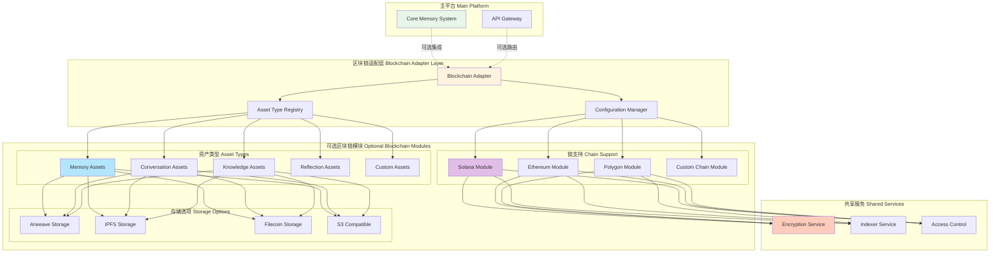

# 区块链模块化架构设计

## 设计理念

区块链模块作为**可选插件**，支持：
- ✅ 完全独立运行（不依赖主平台）
- ✅ 灵活配置（选择性启用功能）
- ✅ 多链支持（Solana、Ethereum、Polygon 等）
- ✅ 可扩展资产类型（记忆、对话、知识图谱等）
- ✅ 零侵入集成（主平台无需修改）

## 模块化架构



## 配置系统

### 1. 主配置文件

```typescript
// blockchain/config/blockchain.config.ts

export interface BlockchainConfig {
  // 全局开关
  enabled: boolean;
  
  // 链配置
  chains: {
    solana?: SolanaConfig;
    ethereum?: EthereumConfig;
    polygon?: PolygonConfig;
    custom?: CustomChainConfig[];
  };
  
  // 资产类型配置
  assetTypes: {
    memory?: MemoryAssetConfig;
    conversation?: ConversationAssetConfig;
    knowledge?: KnowledgeAssetConfig;
    reflection?: ReflectionAssetConfig;
    custom?: CustomAssetConfig[];
  };
  
  // 存储配置
  storage: {
    provider: 'arweave' | 'ipfs' | 'filecoin' | 's3' | 'custom';
    config: StorageProviderConfig;
  };
  
  // 加密配置
  encryption: {
    enabled: boolean;
    algorithm: 'aes-256-gcm' | 'chacha20-poly1305';
    keyDerivation: 'pbkdf2' | 'argon2' | 'scrypt';
  };
  
  // 索引配置
  indexer: {
    enabled: boolean;
    realtime: boolean;
    cacheProvider: 'redis' | 'memory';
  };
  
  // 访问控制
  accessControl: {
    enabled: boolean;
    defaultPolicy: 'private' | 'public' | 'restricted';
  };
}

// 示例配置
export const defaultConfig: BlockchainConfig = {
  enabled: false, // 默认关闭
  chains: {},
  assetTypes: {},
  storage: {
    provider: 'arweave',
    config: {}
  },
  encryption: {
    enabled: true,
    algorithm: 'aes-256-gcm',
    keyDerivation: 'pbkdf2'
  },
  indexer: {
    enabled: true,
    realtime: true,
    cacheProvider: 'redis'
  },
  accessControl: {
    enabled: true,
    defaultPolicy: 'private'
  }
};
```

### 2. 链配置示例

```typescript
// Solana 配置
interface SolanaConfig {
  enabled: boolean;
  network: 'mainnet-beta' | 'devnet' | 'testnet' | 'localnet';
  rpcUrl?: string;
  programId?: string;
  features: {
    compressedNFT: boolean;  // 使用压缩 NFT
    metaplex: boolean;       // 使用 Metaplex
    customProgram: boolean;  // 使用自定义程序
  };
  batchConfig?: {
    enabled: boolean;
    minSize: number;
    maxSize: number;
    timeout: number;
  };
}

// Ethereum 配置
interface EthereumConfig {
  enabled: boolean;
  network: 'mainnet' | 'goerli' | 'sepolia' | 'localhost';
  rpcUrl?: string;
  contractAddress?: string;
  features: {
    erc721: boolean;   // 标准 NFT
    erc1155: boolean;  // 多代币标准
    erc4907: boolean;  // 租赁 NFT
  };
}
```

### 3. 资产类型配置

```typescript
// 记忆资产配置
interface MemoryAssetConfig {
  enabled: boolean;
  chain: 'solana' | 'ethereum' | 'polygon' | string;
  
  // 上链条件
  mintingRules: {
    automatic: boolean;           // 自动上链
    minImportance?: number;       // 最小重要性分数
    requireReflection?: boolean;  // 需要反思
    userApproval?: boolean;       // 需要用户批准
  };
  
  // 元数据配置
  metadata: {
    includeContent: boolean;      // 包含完整内容
    includeEmbedding: boolean;    // 包含向量
    includeContext: boolean;      // 包含上下文
    customFields?: string[];      // 自定义字段
  };
  
  // 隐私配置
  privacy: {
    encryptContent: boolean;      // 加密内容
    encryptMetadata: boolean;     // 加密元数据
    publicMetadata?: string[];    // 公开的元数据字段
  };
}

// 对话资产配置
interface ConversationAssetConfig {
  enabled: boolean;
  chain: string;
  
  mintingRules: {
    automatic: boolean;
    minTurns?: number;            // 最小对话轮数
    minDuration?: number;         // 最小持续时间（秒）
    requireSummary?: boolean;     // 需要摘要
  };
  
  metadata: {
    includeMessages: boolean;     // 包含消息
    includeParticipants: boolean; // 包含参与者
    includeSummary: boolean;      // 包含摘要
  };
}

// 知识图谱资产配置
interface KnowledgeAssetConfig {
  enabled: boolean;
  chain: string;
  
  mintingRules: {
    automatic: boolean;
    minNodes?: number;            // 最小节点数
    minEdges?: number;            // 最小边数
    requireValidation?: boolean;  // 需要验证
  };
  
  metadata: {
    includeGraph: boolean;        // 包含图结构
    includeEmbeddings: boolean;   // 包含嵌入
    format: 'json' | 'rdf' | 'graphml';
  };
}
```

## 适配器接口

```typescript
// blockchain/core/adapter.ts

export interface BlockchainAdapter {
  // 初始化
  initialize(config: BlockchainConfig): Promise<void>;
  
  // 检查是否启用
  isEnabled(): boolean;
  
  // 获取支持的链
  getSupportedChains(): string[];
  
  // 获取支持的资产类型
  getSupportedAssetTypes(): string[];
  
  // 铸造资产
  mintAsset(params: MintAssetParams): Promise<MintResult>;
  
  // 批量铸造
  mintBatch(params: MintBatchParams): Promise<BatchMintResult>;
  
  // 查询资产
  queryAssets(params: QueryParams): Promise<Asset[]>;
  
  // 转移资产
  transferAsset(params: TransferParams): Promise<TransferResult>;
  
  // 更新访问控制
  updateAccess(params: AccessParams): Promise<AccessResult>;
  
  // 健康检查
  healthCheck(): Promise<HealthStatus>;
}

// 铸造参数
export interface MintAssetParams {
  assetType: string;           // 'memory' | 'conversation' | 'knowledge' | ...
  chain: string;               // 'solana' | 'ethereum' | ...
  data: any;                   // 资产数据
  metadata?: Record<string, any>;
  options?: {
    encrypt?: boolean;
    storage?: string;
    batch?: boolean;
    priority?: 'low' | 'normal' | 'high';
  };
  signature?: string;          // 钱包签名
}

// 铸造结果
export interface MintResult {
  success: boolean;
  assetId?: string;
  transactionId?: string;
  chain: string;
  storageUri?: string;
  cost?: {
    amount: number;
    currency: string;
  };
  error?: string;
}
```

## 资产类型注册系统

```typescript
// blockchain/core/registry.ts

export class AssetTypeRegistry {
  private types = new Map<string, AssetTypeHandler>();
  
  // 注册资产类型
  register(type: string, handler: AssetTypeHandler): void {
    this.types.set(type, handler);
  }
  
  // 获取处理器
  getHandler(type: string): AssetTypeHandler | undefined {
    return this.types.get(type);
  }
  
  // 列出所有类型
  listTypes(): string[] {
    return Array.from(this.types.keys());
  }
}

// 资产类型处理器接口
export interface AssetTypeHandler {
  // 验证数据
  validate(data: any): Promise<ValidationResult>;
  
  // 准备元数据
  prepareMetadata(data: any): Promise<AssetMetadata>;
  
  // 序列化数据
  serialize(data: any): Promise<Buffer>;
  
  // 反序列化数据
  deserialize(buffer: Buffer): Promise<any>;
  
  // 检查是否应该上链
  shouldMint(data: any, config: any): Promise<boolean>;
}

// 内置处理器示例
export class MemoryAssetHandler implements AssetTypeHandler {
  async validate(data: any): Promise<ValidationResult> {
    // 验证记忆数据结构
    return { valid: true };
  }
  
  async prepareMetadata(data: any): Promise<AssetMetadata> {
    return {
      name: `Memory #${data.id}`,
      description: data.content.substring(0, 100),
      attributes: [
        { trait_type: 'Type', value: data.type },
        { trait_type: 'Importance', value: data.importance },
        { trait_type: 'Timestamp', value: data.timestamp }
      ]
    };
  }
  
  async serialize(data: any): Promise<Buffer> {
    return Buffer.from(JSON.stringify(data));
  }
  
  async deserialize(buffer: Buffer): Promise<any> {
    return JSON.parse(buffer.toString());
  }
  
  async shouldMint(data: any, config: MemoryAssetConfig): Promise<boolean> {
    if (!config.mintingRules.automatic) return false;
    if (config.mintingRules.minImportance && 
        data.importance < config.mintingRules.minImportance) {
      return false;
    }
    return true;
  }
}
```

## 链适配器接口

```typescript
// blockchain/chains/chain-adapter.ts

export interface ChainAdapter {
  // 链信息
  getChainId(): string;
  getChainName(): string;
  
  // 连接
  connect(config: any): Promise<void>;
  disconnect(): Promise<void>;
  isConnected(): boolean;
  
  // 铸造
  mint(params: ChainMintParams): Promise<ChainMintResult>;
  
  // 查询
  query(params: ChainQueryParams): Promise<ChainAsset[]>;
  
  // 转移
  transfer(params: ChainTransferParams): Promise<ChainTransferResult>;
  
  // 访问控制
  updateAccessControl(params: ChainAccessParams): Promise<void>;
  
  // 费用估算
  estimateFee(operation: string, params: any): Promise<FeeEstimate>;
}

// Solana 适配器实现
export class SolanaChainAdapter implements ChainAdapter {
  private connection?: Connection;
  private config?: SolanaConfig;
  
  getChainId(): string {
    return 'solana';
  }
  
  getChainName(): string {
    return 'Solana';
  }
  
  async connect(config: SolanaConfig): Promise<void> {
    this.config = config;
    this.connection = new Connection(
      config.rpcUrl || clusterApiUrl(config.network)
    );
  }
  
  async mint(params: ChainMintParams): Promise<ChainMintResult> {
    // 实现 Solana 铸造逻辑
    if (this.config?.features.compressedNFT) {
      return this.mintCompressedNFT(params);
    } else {
      return this.mintStandardNFT(params);
    }
  }
  
  // ... 其他方法实现
}

// Ethereum 适配器实现
export class EthereumChainAdapter implements ChainAdapter {
  // 类似实现
}
```

## 存储适配器接口

```typescript
// blockchain/storage/storage-adapter.ts

export interface StorageAdapter {
  // 存储提供商信息
  getProviderId(): string;
  getProviderName(): string;
  
  // 上传
  upload(data: Buffer, metadata?: any): Promise<UploadResult>;
  
  // 批量上传
  uploadBatch(items: UploadItem[]): Promise<BatchUploadResult>;
  
  // 下载
  download(uri: string): Promise<Buffer>;
  
  // 检查存在性
  exists(uri: string): Promise<boolean>;
  
  // 费用估算
  estimateCost(size: number): Promise<CostEstimate>;
}

// Arweave 适配器
export class ArweaveStorageAdapter implements StorageAdapter {
  // 实现
}

// IPFS 适配器
export class IPFSStorageAdapter implements StorageAdapter {
  // 实现
}

// S3 兼容适配器
export class S3StorageAdapter implements StorageAdapter {
  // 实现
}
```

## 使用示例

### 1. 完全禁用区块链

```typescript
// .env
BLOCKCHAIN_ENABLED=false
```

### 2. 仅启用 Solana + 记忆资产

```typescript
// blockchain.config.ts
export const config: BlockchainConfig = {
  enabled: true,
  chains: {
    solana: {
      enabled: true,
      network: 'devnet',
      features: {
        compressedNFT: true,
        metaplex: true,
        customProgram: false
      }
    }
  },
  assetTypes: {
    memory: {
      enabled: true,
      chain: 'solana',
      mintingRules: {
        automatic: false,
        minImportance: 0.8,
        userApproval: true
      },
      privacy: {
        encryptContent: true,
        encryptMetadata: false
      }
    }
  },
  storage: {
    provider: 'arweave',
    config: {}
  }
};
```

### 3. 多链 + 多资产类型

```typescript
export const config: BlockchainConfig = {
  enabled: true,
  chains: {
    solana: {
      enabled: true,
      network: 'mainnet-beta',
      features: { compressedNFT: true }
    },
    ethereum: {
      enabled: true,
      network: 'mainnet',
      features: { erc721: true }
    },
    polygon: {
      enabled: true,
      network: 'mainnet',
      features: { erc1155: true }
    }
  },
  assetTypes: {
    memory: {
      enabled: true,
      chain: 'solana',  // 记忆用 Solana（便宜）
      mintingRules: { automatic: true, minImportance: 0.7 }
    },
    conversation: {
      enabled: true,
      chain: 'polygon',  // 对话用 Polygon（中等成本）
      mintingRules: { automatic: false, minTurns: 10 }
    },
    knowledge: {
      enabled: true,
      chain: 'ethereum',  // 知识图谱用 Ethereum（高价值）
      mintingRules: { automatic: false, requireValidation: true }
    }
  },
  storage: {
    provider: 'ipfs',  // 使用 IPFS 存储
    config: {
      gateway: 'https://ipfs.io',
      pinningService: 'pinata'
    }
  }
};
```

### 4. 自定义资产类型

```typescript
// 注册自定义资产类型
import { AssetTypeRegistry } from './blockchain/core/registry';

class CustomAssetHandler implements AssetTypeHandler {
  async validate(data: any): Promise<ValidationResult> {
    // 自定义验证逻辑
    return { valid: true };
  }
  
  async prepareMetadata(data: any): Promise<AssetMetadata> {
    // 自定义元数据
    return {
      name: `Custom Asset`,
      description: data.description,
      attributes: []
    };
  }
  
  async serialize(data: any): Promise<Buffer> {
    // 自定义序列化
    return Buffer.from(JSON.stringify(data));
  }
  
  async deserialize(buffer: Buffer): Promise<any> {
    return JSON.parse(buffer.toString());
  }
  
  async shouldMint(data: any, config: any): Promise<boolean> {
    // 自定义上链规则
    return data.shouldMint === true;
  }
}

// 注册
const registry = new AssetTypeRegistry();
registry.register('custom-asset', new CustomAssetHandler());
```

## API 集成

```typescript
// services/api-gateway/src/routes/blockchain.ts

router.post('/blockchain/mint', async (req, res) => {
  // 检查区块链是否启用
  if (!blockchainAdapter.isEnabled()) {
    return res.status(503).json({
      error: 'Blockchain module is not enabled'
    });
  }
  
  const { assetType, data, options } = req.body;
  
  // 检查资产类型是否支持
  if (!blockchainAdapter.getSupportedAssetTypes().includes(assetType)) {
    return res.status(400).json({
      error: `Asset type '${assetType}' is not supported`
    });
  }
  
  try {
    const result = await blockchainAdapter.mintAsset({
      assetType,
      data,
      options,
      signature: req.headers['x-wallet-signature']
    });
    
    res.json(result);
  } catch (error) {
    res.status(500).json({ error: error.message });
  }
});

// 健康检查端点
router.get('/blockchain/health', async (req, res) => {
  if (!blockchainAdapter.isEnabled()) {
    return res.json({ enabled: false });
  }
  
  const health = await blockchainAdapter.healthCheck();
  res.json(health);
});
```

## 目录结构

```
blockchain/
├── core/                      # 核心适配器层
│   ├── adapter.ts            # 主适配器接口
│   ├── registry.ts           # 资产类型注册表
│   └── config.ts             # 配置管理
├── chains/                    # 链适配器
│   ├── chain-adapter.ts      # 链适配器接口
│   ├── solana/               # Solana 实现
│   ├── ethereum/             # Ethereum 实现
│   ├── polygon/              # Polygon 实现
│   └── custom/               # 自定义链支持
├── assets/                    # 资产类型处理器
│   ├── asset-handler.ts      # 处理器接口
│   ├── memory/               # 记忆资产
│   ├── conversation/         # 对话资产
│   ├── knowledge/            # 知识资产
│   ├── reflection/           # 反思资产
│   └── custom/               # 自定义资产
├── storage/                   # 存储适配器
│   ├── storage-adapter.ts    # 存储接口
│   ├── arweave/              # Arweave 实现
│   ├── ipfs/                 # IPFS 实现
│   ├── filecoin/             # Filecoin 实现
│   └── s3/                   # S3 兼容实现
├── services/                  # 共享服务
│   ├── encryption/           # 加密服务
│   ├── indexer/              # 索引服务
│   └── access-control/       # 访问控制
├── sdk/                       # SDK
│   ├── typescript/           # TypeScript SDK
│   └── rust/                 # Rust SDK
├── cli/                       # CLI 工具
├── examples/                  # 使用示例
└── config/                    # 配置文件
    ├── blockchain.config.ts  # 主配置
    ├── chains/               # 链配置
    ├── assets/               # 资产配置
    └── storage/              # 存储配置
```

## 优势总结

1. **完全可选**：可以完全禁用区块链功能
2. **灵活配置**：细粒度控制每个功能
3. **多链支持**：轻松添加新的区块链
4. **可扩展**：自定义资产类型和存储
5. **零侵入**：不影响主平台代码
6. **渐进式**：可以逐步启用功能
7. **成本优化**：根据需求选择最优链和存储
8. **隐私保护**：灵活的加密和访问控制

