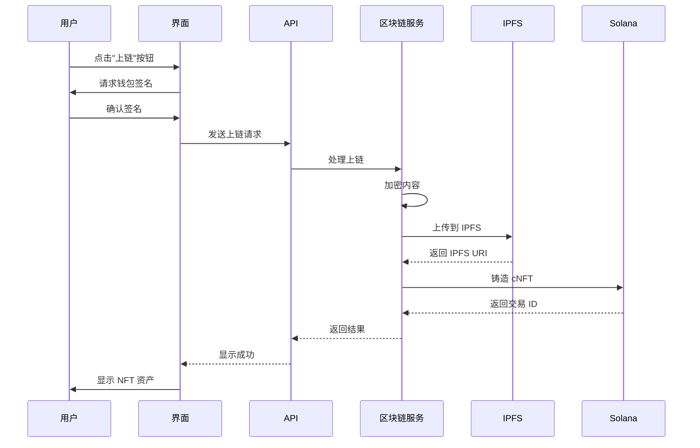

# 区块链记忆上链用户指南

## 核心理念

**所有记忆都可以上链，完全由你决定！**

- ✅ 任何记忆都可以上链（不限类型、不限重要性）
- ✅ 完全可选（不会自动上链）
- ✅ 默认使用 Solana + IPFS（成本最优）
- ✅ 内容加密（保护隐私）
- ✅ 永久保存（不可删除）

## 快速开始

### 1. 启用区块链功能

```bash
# .env
BLOCKCHAIN_ENABLED=true
SOLANA_ENABLED=true
MEMORY_ASSET_ENABLED=true
STORAGE_PROVIDER=ipfs
```

### 2. 配置 IPFS（推荐）

```bash
# 使用 Pinata（免费）
IPFS_PINNING_SERVICE=pinata
PINATA_API_KEY=your_api_key
PINATA_API_SECRET=your_api_secret
```

获取 Pinata API Key：https://pinata.cloud

### 3. 配置 Solana 钱包

```bash
# 生成钱包（开发环境）
solana-keygen new --outfile ~/.config/solana/devnet.json

# 获取测试 SOL
solana airdrop 2
```

### 4. 开始使用

所有记忆都会显示"上链"按钮，点击即可上链！

## 使用场景

### 场景 1：重要对话记录

```typescript
// 创建记忆
const memory = await createMemory({
  content: "与客户讨论了项目需求，确定了交付时间",
  type: "episodic",
  importance: 0.9
});

// 用户点击"上链"按钮
await mintMemory(memory.id);
```

**结果**：
- 记忆永久保存在区块链
- 内容加密存储在 IPFS
- 获得 NFT 资产证明
- 成本：~$0.006

### 场景 2：日常笔记

```typescript
// 创建普通记忆
const memory = await createMemory({
  content: "今天学习了 React Hooks",
  type: "semantic",
  importance: 0.5
});

// 用户也可以选择上链（虽然不重要）
await mintMemory(memory.id);
```

**结果**：
- 即使是普通记忆也可以上链
- 完全由用户决定
- 成本相同：~$0.006

### 场景 3：批量上链

```typescript
// 选择多条记忆
const memoryIds = ['mem-001', 'mem-002', 'mem-003', ...];

// 批量上链（节省成本）
await mintBatch(memoryIds);
```

**结果**：
- 批量处理降低成本 30-50%
- 一次交易完成多条记忆上链
- 成本：~$0.004/条

## 上链流程



## API 使用

### 上链单条记忆

```typescript
POST /v1/blockchain/memories/mint

{
  "memoryId": "mem-001",
  "options": {
    "encrypt": true,      // 是否加密（默认 true）
    "priority": "normal"  // 优先级：low, normal, high
  }
}

// 响应
{
  "success": true,
  "assetId": "asset-xyz",
  "transactionId": "tx-abc",
  "storageUri": "ipfs://Qm...",
  "cost": {
    "amount": 0.006,
    "currency": "USD"
  }
}
```

### 批量上链

```typescript
POST /v1/blockchain/memories/mint-batch

{
  "memoryIds": ["mem-001", "mem-002", "mem-003"],
  "options": {
    "encrypt": true
  }
}

// 响应
{
  "success": true,
  "results": [
    { "memoryId": "mem-001", "assetId": "asset-1", ... },
    { "memoryId": "mem-002", "assetId": "asset-2", ... },
    { "memoryId": "mem-003", "assetId": "asset-3", ... }
  ],
  "totalCost": {
    "amount": 0.012,
    "currency": "USD"
  }
}
```

### 查询已上链记忆

```typescript
GET /v1/blockchain/memories?walletAddress=xxx

// 响应
{
  "memories": [
    {
      "assetId": "asset-xyz",
      "memoryId": "mem-001",
      "content": "...",  // 如果有权限
      "metadata": {
        "timestamp": "2024-01-15T10:30:00Z",
        "type": "episodic",
        "importance": 0.9
      },
      "storageUri": "ipfs://Qm...",
      "createdAt": "2024-01-15T10:30:00Z"
    }
  ]
}
```

## 前端集成

### React 组件示例

```typescript
import { useMemoryMinting } from './hooks/useMemoryMinting';

function MemoryCard({ memory }) {
  const { mintMemory, isMinting } = useMemoryMinting();

  const handleMint = async () => {
    try {
      const result = await mintMemory(memory.id);
      alert(`上链成功！资产 ID: ${result.assetId}`);
    } catch (error) {
      alert(`上链失败: ${error.message}`);
    }
  };

  return (
    <div className="memory-card">
      <h3>{memory.content}</h3>
      <p>重要性: {memory.importance}</p>
      
      {!memory.onChain ? (
        <button 
          onClick={handleMint}
          disabled={isMinting}
        >
          {isMinting ? '上链中...' : '上链保存'}
        </button>
      ) : (
        <div className="on-chain-badge">
          ✓ 已上链
          <a href={`https://solscan.io/tx/${memory.transactionId}`}>
            查看交易
          </a>
        </div>
      )}
    </div>
  );
}
```

### 批量选择示例

```typescript
function MemoryList({ memories }) {
  const [selected, setSelected] = useState<string[]>([]);
  const { mintBatch, isMinting } = useMemoryMinting();

  const handleBatchMint = async () => {
    try {
      const result = await mintBatch(selected);
      alert(`成功上链 ${result.successful} 条记忆`);
      setSelected([]);
    } catch (error) {
      alert(`批量上链失败: ${error.message}`);
    }
  };

  return (
    <div>
      <div className="toolbar">
        <span>{selected.length} 条已选择</span>
        <button 
          onClick={handleBatchMint}
          disabled={selected.length === 0 || isMinting}
        >
          批量上链（节省 {Math.round((1 - 0.004/0.006) * 100)}% 成本）
        </button>
      </div>

      {memories.map(memory => (
        <MemoryCard
          key={memory.id}
          memory={memory}
          selected={selected.includes(memory.id)}
          onSelect={(id) => setSelected([...selected, id])}
        />
      ))}
    </div>
  );
}
```

## 成本说明

### Solana + IPFS 成本

| 操作 | 成本 | 说明 |
|------|------|------|
| 单条上链 | ~$0.006 | 包含 Solana cNFT + IPFS 存储 |
| 批量上链（10+） | ~$0.005/条 | 节省 ~17% |
| 批量上链（50+） | ~$0.004/条 | 节省 ~33% |
| 批量上链（100+） | ~$0.003/条 | 节省 ~50% |

### 月度成本估算

| 使用量 | 单条上链 | 批量上链 |
|--------|---------|---------|
| 10 条/月 | $0.06 | $0.05 |
| 50 条/月 | $0.30 | $0.20 |
| 100 条/月 | $0.60 | $0.40 |
| 500 条/月 | $3.00 | $2.00 |
| 1000 条/月 | $6.00 | $4.00 |

### 成本优化建议

1. **使用批量上链**：积累 10+ 条记忆后批量处理
2. **选择性上链**：只上链真正重要的记忆
3. **使用 IPFS**：比 Arweave 便宜且快速
4. **开发环境**：使用 devnet（免费测试）

## 常见问题

### Q: 所有记忆都需要上链吗？

**A**: 不需要！上链完全可选。建议只上链重要的记忆：
- 重要决策和协议
- 里程碑和成就
- 创意和灵感
- 需要永久保存的内容

### Q: 上链后可以删除吗？

**A**: 不可以！区块链数据是永久的、不可删除的。上链前请确认。

### Q: 上链的内容安全吗？

**A**: 是的！内容默认使用 AES-256-GCM 加密，只有你的钱包可以解密。

### Q: IPFS 和 Arweave 有什么区别？

**A**: 
- **IPFS**：快速、经济、需要 pinning 服务
- **Arweave**：永久存储、一次付费、上传较慢

默认使用 IPFS，可选开启 Arweave 备份。

### Q: 如何查看已上链的记忆？

**A**: 
1. 在应用中查看"已上链"标签
2. 访问 Solscan 查看交易：`https://solscan.io/tx/{transactionId}`
3. 使用 CLI 工具：`memory-cli query --wallet xxx`

### Q: 上链失败怎么办？

**A**: 常见原因：
1. 钱包余额不足 → 充值 SOL
2. 网络拥堵 → 稍后重试
3. IPFS 上传失败 → 检查 API 密钥

### Q: 可以转移已上链的记忆吗？

**A**: 可以！记忆作为 NFT 资产，可以转移给其他钱包：

```typescript
POST /v1/blockchain/memories/transfer

{
  "assetId": "asset-xyz",
  "to": "recipient_wallet_address"
}
```

### Q: 如何授权他人访问？

**A**: 使用访问控制功能：

```typescript
POST /v1/blockchain/memories/{assetId}/grant

{
  "grantee": "wallet_address",
  "permissions": ["read"],
  "expiresAt": "2024-12-31T23:59:59Z"
}
```

## 最佳实践

### 1. 选择性上链

不是所有记忆都需要上链。建议上链：
- ✅ 重要性 ≥ 0.7 的记忆
- ✅ 用户明确标记为"重要"的记忆
- ✅ 需要永久保存的记忆
- ✅ 可能产生价值的记忆

### 2. 使用批量处理

积累 10+ 条记忆后批量上链，可节省 30-50% 成本。

### 3. 定期备份

虽然区块链数据永久保存，但建议：
- 定期导出记忆列表
- 保存钱包私钥（安全存储）
- 记录重要的交易 ID

### 4. 合理使用加密

- 敏感内容：必须加密
- 公开分享：可以不加密
- 团队协作：考虑使用访问控制

### 5. 监控成本

- 设置月度预算
- 使用批量处理
- 定期审查上链记忆

## 开发环境 vs 生产环境

### 开发环境（Devnet）

```bash
SOLANA_NETWORK=devnet
SOLANA_RPC_URL=https://api.devnet.solana.com

# 免费获取测试 SOL
solana airdrop 2
```

**特点**：
- ✅ 完全免费
- ✅ 快速测试
- ❌ 数据可能被清除
- ❌ 不适合生产

### 生产环境（Mainnet）

```bash
SOLANA_NETWORK=mainnet-beta
SOLANA_RPC_URL=https://api.mainnet-beta.solana.com

# 需要真实 SOL
```

**特点**：
- ✅ 永久保存
- ✅ 真实资产
- ❌ 需要真实成本
- ✅ 适合生产

## 下一步

1. **配置环境**：按照快速开始配置 `.env`
2. **测试上链**：在 devnet 测试上链流程
3. **集成前端**：添加"上链"按钮到你的应用
4. **生产部署**：切换到 mainnet

## 获取帮助

- 📖 [完整文档](./CONFIGURATION_GUIDE.md)
- 🔧 [API 参考](./sdk/API_REFERENCE.md)
- 💬 [GitHub Issues](https://github.com/your-repo/issues)
- 📧 Email: support@example.com

---

**记住**：上链是永久的，请谨慎选择！但不用担心，所有记忆都可以上链，完全由你决定。🚀
